# 1. Product introduction

**Keyestudio Smart Little Turtle Robot V2.0**

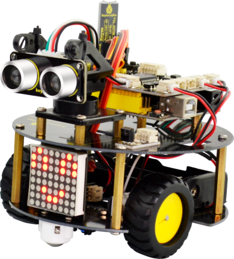

## 1.1 Intorduction

When you tell your child how beautiful the world is, it is better to take him directly to feel it; when the child asks you why the small alarm clock always sings, it is better to open the alarm clock and explore the secret of the sound with your child. When your child has a desire for a robot gift, you might do it with him as well! Now with ARDUINO, everything is impossible.

Arduino is a convenient, flexible and easy-to-use open source electronic prototyping platform, which is suitable for entry-level developers who are new to hardware. 

Now our keyestudio team has upgraded the turtle robot based on the turtle generation1, adding some more interesting features. Let you enjoy the DIY fun and programming while learning with your child.

keyestudio Smart Little Turtle V2.0 is an enhanced kit based on easy-to-use and flexible Arduino platform. You are able to learn how to get started with both Arduino platform and Mixly block coding.

We provide you with complete tutorials of Arduino programming language and Mixly Graphical program to control the smart turtle robot, achieving the functions of line tracking, automatic obstacle avoidance, Bluetooth control and infrared remote control.

Furthermore, it adds a 8*8 matrix that can show you the running states of robot. The wiring for the turtle robot is more simple.You can easily build the robot with a little or even no programming experience.

## 1.2 Parameters

- Motor’s voltage range: 1-6V; motor shaft length: 10mm; speed: 6.0V 100rpm/min.
- Motor control is driven by L298P.
- Three groups of line tracking modules, to detect black-white line with higher accuracy and can also be used for anti-fall control.
- Ultrasonic module is used to detect whether there is obstacles or not.
- Bluetooth wireless modulecan be paired with Bluetooth device on phone to remotely control the turtle robot.
- Infrared receiver modulematches with an infrared remote control to control the turtle robot.
- Add a 8*8 dot matrix module, showing the robot states.
- Can access to the external voltage 6~ 12V

## 1.3 Component List

When get this turtle robot kit, at first glance, you will see the beautiful big packaging box. And each component is tidily packed inside the small box. What components you should get to build the robot? We have listed all the components as follows:

| No.  | **Component**                                                | **Quantity** | Picture                                |
| ---- | ------------------------------------------------------------ | ------------ | -------------------------------------- |
| 1    | Keyestudio REV4 Main Board                                   | 1            | 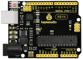 |
| 2    | Keyestudio quick connectors motor driver shield              | 1            | 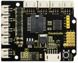 |
| 3    | Keyestudio quick connectors IR receiver module               | 1            | 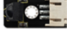 |
| 4    | Keyestudio quick connectors line tracking sensor             | 1            | 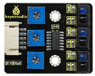 |
| 5    | Keyestudio quick connectors 12FN20 motor A                   | 1            | 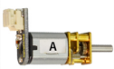 |
| 6    | Keyestudio quick connectors 12FN20 motor B                   | 1            | 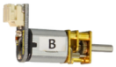 |
| 7    | Keyestudio 8x8 Dot Matrix Module                             | 1            | 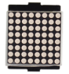 |
| 8    | Keyestudio quick connectors ultrasonic module                | 1            |  |
| 9    | keyestudio Bluetooth module HC-06                            | 1            | 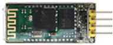 |
| 10   | Keyestudio JMFP-4 17-button 86*40*6.5MM remote control (no battery) | 1            | 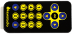 |
| 11   | Double-Connector JST-PH2.0MM-5P 24AWG blue-green-yellow-red-black wire 15CM | 1            | 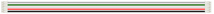 |
| 12   | Double-Connector JST-PH2.0MM-4P 24AWG green-yellow-red-black wire 8CM | 1            | 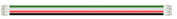 |
| 13   | Double-Connector JST-PH2.0MM-3P 24AWG yellow-red-black wire 8CM | 1            |  |
| 14   | Double-Connector JST-PH2.0MM-2P 24AWG red-black wire 160mm   | 2            | 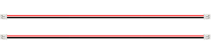 |
| 15   | Battery holder with JST-PH2.0MM-2P socket lead, black-red lead length 150mm | 1            | 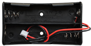 |
| 16   | 4-cell AA battery case                                       | 1            | 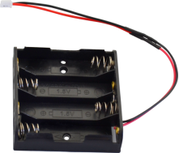 |
| 17   | Screw M2*12MM round head                                     | 4            | 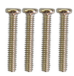 |
| 18   | Nut M2 nickle plating                                        | 4            | 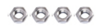 |
| 19   | Screw M3*6MM round head                                      | 27           | 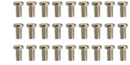 |
| 20   | Screw M3*6MM flat head                                       | 2            |  |
| 21   | Nut M3 nickle plating                                        | 5            | 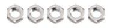 |
| 22   | Dual-pass M3*10MM Copper Pillar                              | 8            | 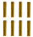 |
| 23   | Dual-pass M3*40MM Copper Pillar                              | 4            | 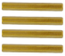 |
| 24   | keyestudio 9G 23 * 12.2 * 29mm black servo 180° with mounts  | 1            | 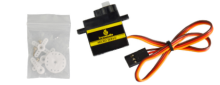 |
| 25   | N20 motor wheel                                              | 2            | 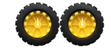 |
| 26   | White U-type wheel holder                                    | 2            | 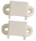 |
| 27   | Black plastic platform                                       | 1            | 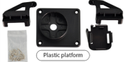 |
| 28   | 3PI miniQ universal caster 304 stainless steel               | 2            | 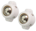 |
| 29   | Black-yellow Handle 3*40MM cross screwdriver                 | 1            | 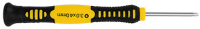 |
| 30   | 1m USB cable                                                 | 1            | 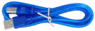 |
| 31   | Black cable ties 3*100MM                                     | 5            | 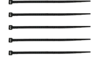 |
| 32   | Robot bottom PCB                                             | 1            | 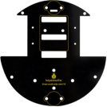 |
| 33   | Robot TOP PCB                                                | 1            | 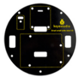 |
| 34   | female-female jumper wire                                    | 4            | 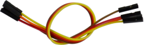 |
| 35   | keyestudio LED Module                                        | 1            | 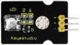 |
| 36   | 3Pin female header jumper wire length 20CM 2.54mm            | 1            | 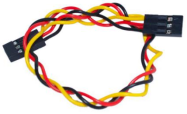 |

## 1.4 REV4 Control Board

When it comes to using the REV4 as core of our robot, the REV4 is the best board to get started with electronics and coding. If this is your first experience tinkering with the platform, the REV4 is the most robust board you can start playing with.

Well, let's at first have a look at this REV4 board.

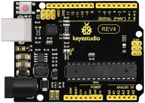

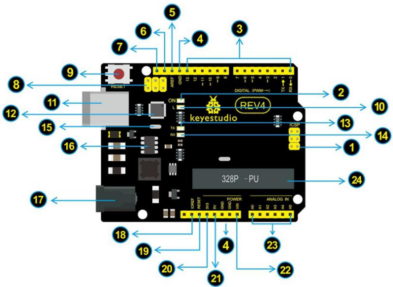

| No.                                                          | Description                                                  |
| ------------------------------------------------------------ | ------------------------------------------------------------ |
|                        | USB Connection Arduino board can be powered via USB connector. Or you can program the board via the USB port. |
|                        | **DC Power Jack** Arduino board can be supplied with power from the DC power jack |
|                        | **Voltage Regulator** To control the voltage provided to the Arduino board, as well as to stabilize the DC voltage used by the processor and other components. |
|                        | **Crystal Oscillator** How does Arduino calculate time? by using a crystal oscillator. The number printed on the top of the Arduino crystal is 16.000H9H. It tells us that the frequency is 16,000,000 Hertz or 16MHz. |
|  | **Arduino RESET** You can reset your Arduino board, for example, start the program from the very beginning. Firstly, use the RESET button（17）. Or you can connect an external reset button to Arduino pin 5 labeled RESET. |
| 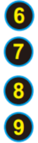                       | **Pin Header (3.3V，5V，GND，Vin)** 3.3V - provides 3.3V output voltage 5V - provides 5V output voltage Using 3.3 volts and 5 volts, most components can normally operate with Arduino board together. GND（Ground pins)- two GND headers on Arduino, each of which can be used for circuit ground. Vin - You can supply an external power (like AC power supply) through this pin to Arduino board. |
|                        | **Analog Pins** Arduino REV4 board has 6 analog inputs, labeled A0 through A5. These pins can read the signal from analog sensors (such as humidity sensor or temperature sensor), and convert it into the digital value that can read by microcontrollers). |
|                        | **Microcontroller** Each Arduino board has its own microcontroller. You can regard it as the brain of your board. The main IC (integrated circuit) on the Arduino is slightly different from the panel pair. Microcontrollers are usually from ATMEL. Before you load a new program from the Arduino IDE, you must know what IC is on your board. This information can be checked at the top of IC. |
|                        | **ICSP(In-Circuit Serial Programming) Header** In most case, ICSP is the AVR，an Arduino micro-header consisting of MOSI, MISO, SCK, RESET, VCC, and GND. It is often called the SPI (serial peripheral interface) and can be considered an "extension" of the output. In fact, put the output devices subordinate to the SPI bus host. |
|                        | **Power LED Indicator** Powering the Arduino, LED on means that your circuit board is correctly powered on. If LED is off, connection is wrong. |
|                        | **TX and RX LED** Onboard you can find two labels:　RX(receive ) and TX (transmit) First appear on digital pin 0 and 1 for serial communication;  Besides, the RX LED on the board will flash in different speed when serial data is being transmitted. The flash speed depends on the baud rate set by board. And RX LED will also flash during the receiving process. |
|                        | **Digital I/O** Arduino REV4 has 14 digital input/output pins (of which 6 can be used as PWM outputs). These pins can be configured as digital input pin to read the logic value (0 or 1). Or used as digital output pin to drive different modules like LED, relay, etc. The pin labeled “〜” can be used to generate PWM. |
|                        | **AREF** Reference voltage( 0-5V) for the analog inputs. Used with analogReference(). |

