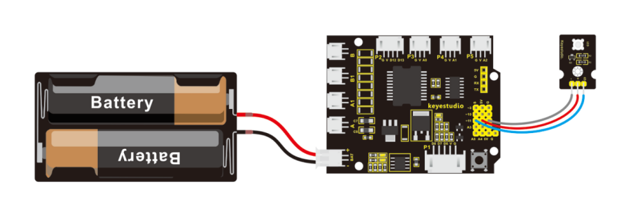
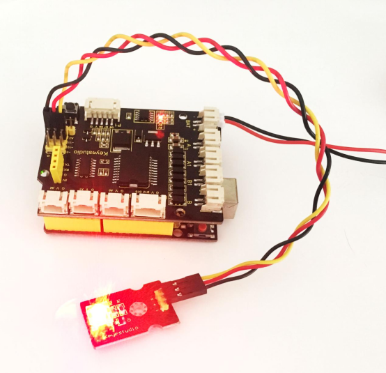

### Project 1 Light up an LED

**1.Overview**

In the above section, you have learned how to use the development software. So want to try it out with an example project? Get started with one more basic program, bringing you enter the wonderful programming world of ARDUINO. Great, follow the project sections below to have your first awesome try!

LED experiment is one of the more basic experiments in learning ARDUINO. Here we will use our keyestudio LED module. On the module, you will see a light emitting diode (LED), which has two states of on and off. Since our module itself has done well the circuit, you can use it in a simple way. Just need to connect its pins.

There are three lead-out pins on the module, respectively negative pin(marked -), positive pin(marked +) and signal pin(marked S). Note that the modules from different manufactures may have different pin labels.

Next, connect the three pins of LED module to keyestudio UNO R3 shield using three dupont jumper wires. Connect negative pin to the ground, positive pin to 5V, and signal pin to Digital 11. Shown as below.

**2.Connect It Up**



**3.Test Code 1**

```c
int ledpin=11; // define the LED pin as Digital 11

void setup() 
{  
	pinMode(11, OUTPUT); // initialize digital pin 11 as an output.
}

void loop()
{
  digitalWrite(11, HIGH);   // turn the LED on (HIGH is the voltage level)
  delay(1000);              // wait for a second
  digitalWrite(11, LOW);    // turn the LED off by making the voltage LOW
  delay(1000);              // wait for a second
}
```

**4.Result** 

Eventually, you will see the LED light up for one second, then off one second. Congrats! Your first programming is done successfully.


