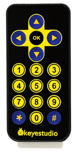
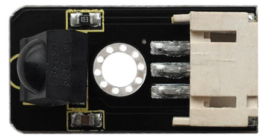
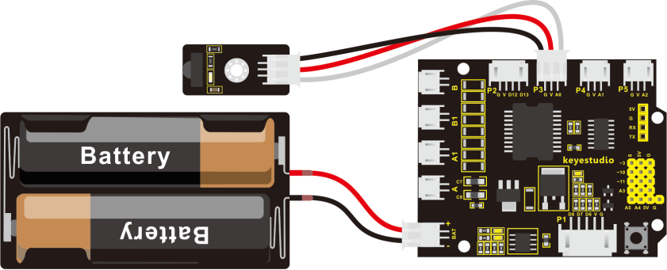
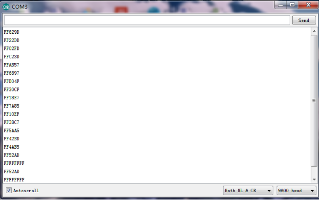
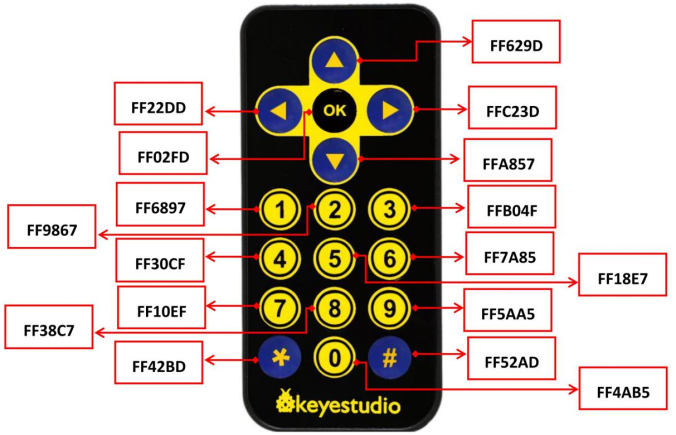
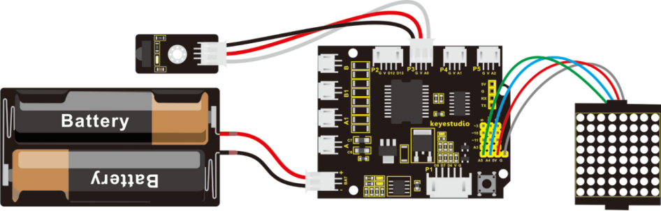
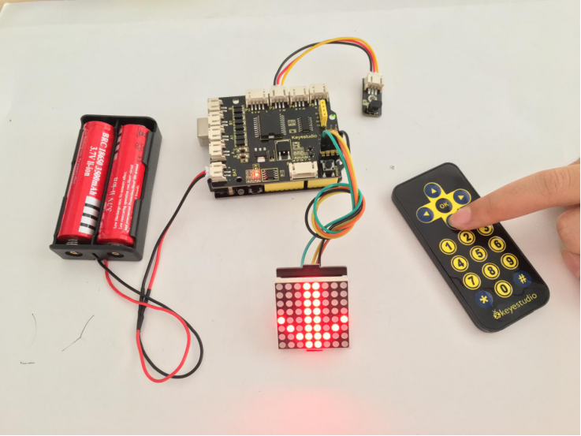

### Project 10 Principle and Application of Infrared Receiver



**1.Principle of IR Remote Control**

There is no doubt that infrared remote control is commonly seen in our daily life. It's hard to imagine our world without it.

In reality, an infrared remote control can be used to control a wide range of home appliances such as television, audio, video recorders and satellite signal receivers. It is so practical. Well, in the following let’s get a better understanding of the infrared remote control.

Infrared remote control is composed of infrared transmitting and infrared receiving systems. That is, consist of an infrared remote control, an infrared receiver module and a microcontroller that can decode. You can refer to the figure below.


The 38K infrared carrier signal transmitted by an infrared remote controller is encoded by an encoding chip inside the remote controller. It is composed of a pilot code, user code, data code, and data inversion code.

The time interval between pulses is used to distinguish whether it is a signal 0 or 1. (when the ratio of high level to low level is about 1:1, considered as signal 0.) And the encoding is just well composed of signal 0 and 1.

The user code of the same button on remote controller is unchanged. Using difference data distinguish the key pressed on the remote control.

When press down a button on the remote control, it will send out an infrared carrier signal. And when infrared receiver receives that signal, its program will decode the carrier signal, and through different data codes, thus can judge which key is pressed.

The microcontroller is decoded by an received signal 0 or 1 to determine which key is pressed by the remote control.

As for an infrared receiver module, it is mainly composed of an infrared receiving head. This device integrates with reception, amplification and demodulation. Its internal IC has been demodulated, able to complete all the work from infrared reception to output TTL level signal compatible. It outputs Digital signal. Suitable for IR remote control and infrared data transmission.

The infrared receiver module has only three pins (Signal line, VCC, GND), very convenient to communicate with Arduino and other microcontrollers.



**2.Parameters of IR Receiver:**

- Operating Voltage: 3.3-5V（DC）
- Interface: 3PIN
- Output Signal: Digital signal
- Receiving Angle: 90 degrees
- Frequency: 38khz
- Receiving Distance: 18m

**3.Decoding and Control of IR Remote Control**

First of all, let’s figure out the decoding. You can refer to the steps as follows:

Connect the infrared receiver module to the P3 connector on the shield using the connector wire.




**4.Code 12**

```c
#include <IRremote.h> // library file
int RECV_PIN = 15;  //receiver module is connected to A1，namely Digital 15
IRrecv irrecv(RECV_PIN);
decode_results results;

void setup()
{
  Serial.begin(9600); // set the baud rate
  irrecv.enableIRIn(); // Start the receiver
}

void loop() 
{
  if (irrecv.decode(&results)) // if receive the code
  {  
    Serial.println(results.value, HEX);  // print the value of remote control
    irrecv.resume(); // Receive the next value
  }
}
```

Upload well the above code to ARDUINO controller, then open the serial monitor and set the baud rate to 9600. Aimed at the IR receiver sensor, press down the button of remote control, you will see the corresponding encode of button is displayed on the monitor. If you press the button too long, it will easily appear a messy code like FFFFFF shown as below.



Below we have listed out each button value of keyestudio remote control. You can keep it for reference.



Next, let’s use the remote control to make a small experiment. Use the remote control to make 8*8 dot matrix display different images.

**5.Hookup Guide**

Connect the IR receiver and dot matrix to the shield as the figure shown below:



**6.Code 13**

```c
#// dot matrix
#include <Wire.h>   // add the IIC libraries
#include "Adafruit_LEDBackpack.h"   // add the libraries of dot matrix 
#include "Adafruit_GFX.h"
Adafruit_LEDBackpack matrix = Adafruit_LEDBackpack();   // build an object to control the dot matrix 

// IR receiver 
#include <IRremote.h>    // add the libraries of IR receiver   
int RECV_PIN = A0;        // define the IR receiver pin as A0
IRrecv irrecv(RECV_PIN);
decode_results results;
// decoding of remote control 
const long IR_front = 0x00FF629D;
const long IR_back = 0x00FFA857;
const long IR_left = 0x00FF22DD;
const long IR_right = 0x00FFC23D;
const long IR_stop = 0x00FF02FD;
const long IR_1 = 0x00FF6897;
const long IR_2 = 0x00FF9867;
const long IR_3 = 0x00FFB04F;
const long IR_4 = 0x00FF30CF;
const long IR_5 = 0x00FF18E7;
const long IR_6 = 0x00FF7A85;
const long IR_7 = 0x00FF10EF;
const long IR_8 = 0x00FF38C7;
const long IR_9 = 0x00FF5AA5;
const long IR_0 = 0x00FF52AD;

void setup() 
{ 
  Serial.begin(9600);           // set the baud rate to 9600
  irrecv.enableIRIn();            // Start the receiver
  delay(100);           //delay 100ms

  //dot matrix
  matrix.begin(0x70);  // pass in the address
  chushi();         // the matrix display when starting up 
}

void loop() 
{
  if(irrecv.decode(&results))   // if receive the IR signal
  {
    int val = results.value;      // assign the received result to val
    Serial.println(val,HEX);    // print out the hexadecimal val value on the serial monitor 
    
    switch(val)   // perform the corresponding function for the corresponding data received.
    {
      case  IR_front:  qian();  break;  // display the front arrow 
      case  IR_back:  hou();    break;  // display the back arrow  
      case  IR_left:  zuo();    break;  // display the left arrow 
      case  IR_right:  you();   break;  //display the right arrow  
      case  IR_stop:  ting();   break;   //display ×
      case  IR_1:  S();   break;         //display S
      case  IR_2:  ZZ();   break;     // display the arrow flexed to the left
      case  IR_3:  YZ();   break;    // display the arrow flexed to the right 
      case  IR_4:  ZX();  break;    // display the arrow turn right in circle
      case  IR_5:  YX();  break;     // the arrow circle turn left in circle 
      default : printf("error");  
    }
    irrecv.resume();    // Receive the next value
  }

}

////////////////////////matrix display image////////////////////////////
// forward 
void qian()
{
    matrix.displaybuffer[3] = B11111111;     
    matrix.displaybuffer[4] = B11111111;
    matrix.displaybuffer[2] = B00000001;
    matrix.displaybuffer[1] = B00000010;
    matrix.displaybuffer[0] = B00000100;
    matrix.displaybuffer[5] = B00000001;
    matrix.displaybuffer[6] = B00000010;
    matrix.displaybuffer[7] = B00000100;
    matrix.writeDisplay();
}
//backward
void hou()
{
    matrix.displaybuffer[3] = B11111111;
    matrix.displaybuffer[4] = B11111111;
    matrix.displaybuffer[2] = B00100000;
    matrix.displaybuffer[1] = B00010000;
    matrix.displaybuffer[0] = B00001000;
    matrix.displaybuffer[5] = B00100000;
    matrix.displaybuffer[6] = B00010000;
    matrix.displaybuffer[7] = B00001000;
    matrix.writeDisplay();
}
//turn right
void you()
{
    for(int i=0;i<8;i++)
    {
      matrix.displaybuffer[i] = B00001100;
    }
    matrix.displaybuffer[6] = B00011110;
    matrix.displaybuffer[5] = B00101101;
    matrix.displaybuffer[4] = B11001100;
    matrix.writeDisplay();
}
//turn left 
void zuo()
{
    for(int i=0;i<8;i++)
    {
      matrix.displaybuffer[i] = B00001100;
    }
    matrix.displaybuffer[1] = B00011110;
    matrix.displaybuffer[2] = B00101101;
    matrix.displaybuffer[3] = B11001100;
    matrix.writeDisplay();
}
//stop
void ting()
{
    matrix.displaybuffer[0] = B11000000;
    matrix.displaybuffer[1] = B00100001;
    matrix.displaybuffer[2] = B00010010;
    matrix.displaybuffer[3] = B00001100;
    matrix.displaybuffer[4] = B00001100;
    matrix.displaybuffer[5] = B00010010;
    matrix.displaybuffer[6] = B00100001;
    matrix.displaybuffer[7] = B11000000;
    matrix.writeDisplay();
}
//start up
void chushi()
{
    matrix.displaybuffer[0] = B00000011;
    matrix.displaybuffer[1] = B10000000;
    matrix.displaybuffer[2] = B00010011;
    matrix.displaybuffer[3] = B00100000;
    matrix.displaybuffer[4] = B00100000;
    matrix.displaybuffer[5] = B00010011;
    matrix.displaybuffer[6] = B10000000;
    matrix.displaybuffer[7] = B00000011;
    matrix.writeDisplay();
}
//S line
void S()
{
    matrix.displaybuffer[0] = B00000000;
    matrix.displaybuffer[1] = B00000000;
    matrix.displaybuffer[2] = B00110001;
    matrix.displaybuffer[3] = B11001000;
    matrix.displaybuffer[4] = B11000100;
    matrix.displaybuffer[5] = B00100011;
    matrix.displaybuffer[6] = B00000000;
    matrix.displaybuffer[7] = B00000000;
    matrix.writeDisplay();
}
// turn around the wheel on the left   
void ZZ()
{
    matrix.displaybuffer[0] = B00000000;
    matrix.displaybuffer[1] = B10000011;
    matrix.displaybuffer[2] = B11000001;
    matrix.displaybuffer[3] = B10100010;
    matrix.displaybuffer[4] = B00010100;
    matrix.displaybuffer[5] = B00001000;
    matrix.displaybuffer[6] = B00000000;
    matrix.displaybuffer[7] = B00000000;
    matrix.writeDisplay();
}
// turn around the wheel on the right
void YZ()
{
    matrix.displaybuffer[0] = B00000000;
    matrix.displaybuffer[1] = B00000000;
    matrix.displaybuffer[2] = B00001000;
    matrix.displaybuffer[3] = B00010100;
    matrix.displaybuffer[4] = B10100010;
    matrix.displaybuffer[5] = B11000001;
    matrix.displaybuffer[6] = B10000011;
    matrix.displaybuffer[7] = B00000000;
    matrix.writeDisplay();
}
//  turn left in circle 
void ZX()
{
    matrix.displaybuffer[0] = B00000000;
    matrix.displaybuffer[1] = B00011100;
    matrix.displaybuffer[2] = B00100010;
    matrix.displaybuffer[3] = B01000001;
    matrix.displaybuffer[4] = B00000001;
    matrix.displaybuffer[5] = B00111001;
    matrix.displaybuffer[6] = B00110010;
    matrix.displaybuffer[7] = B00101100;
    matrix.writeDisplay();
}
//  turn right in circle 
void YX()
{
    matrix.displaybuffer[0] = B00001100;
    matrix.displaybuffer[1] = B00110010;
    matrix.displaybuffer[2] = B00111001;
    matrix.displaybuffer[3] = B00000001;
    matrix.displaybuffer[4] = B00000001;
    matrix.displaybuffer[5] = B00100010;
    matrix.displaybuffer[6] = B00011100;
    matrix.displaybuffer[7] = B00000000;
    matrix.writeDisplay();
}
```

Upload the above code to the board, and turn on the POWER button on the shield. Aligned with the IR receiver, use remote control to control the turtle robot run, showing the running states on the dot matrix display.



