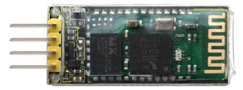
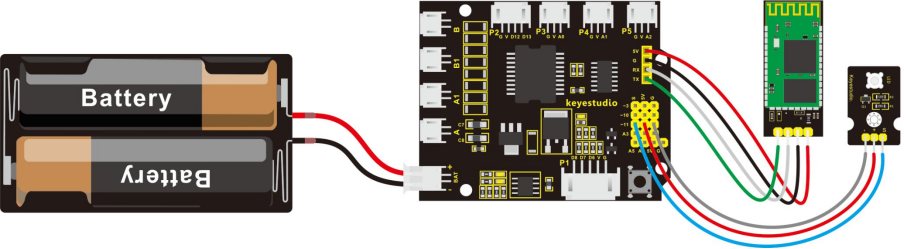
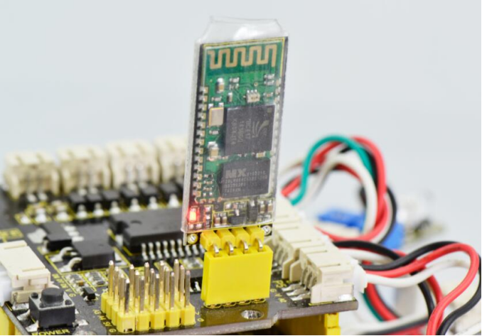
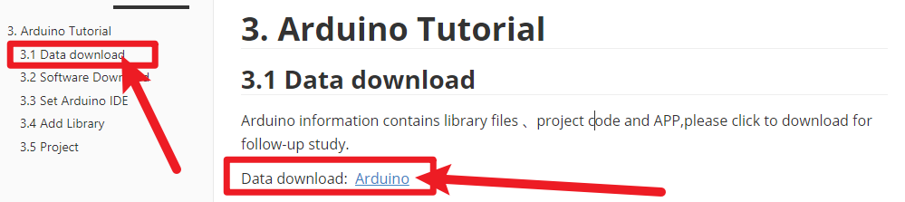
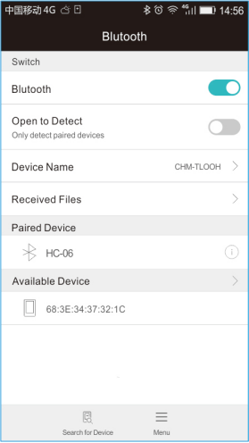
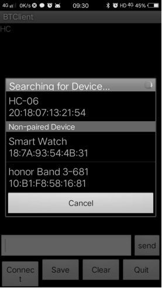
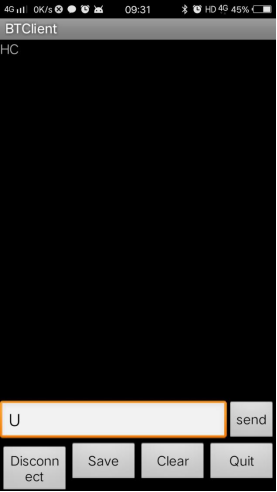
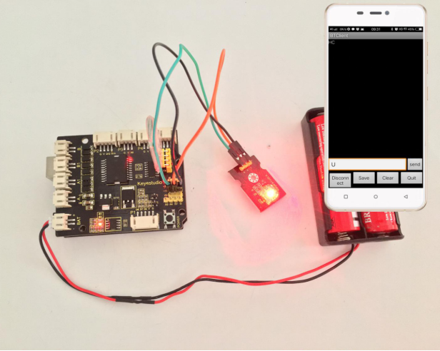

### Project 12 Principle and Application of Bluetooth Remote Control



**1.Overview**

Bluetooth, as the name implies, blue teeth, and he is not used to bite people, but a wireless data transmission method. Bluetooth technology is a wireless standard technology that enables short-range data exchange among fixed devices, mobile devices, and personal area networks of buildings (UHF radio waves in the ISM band of 2.4 to 2.485 GHz).

There are two kinds of commonly used Bluetooth module on the market, HC-05 and HC-06 models. The difference between them is that the HC-05 is a master-slave one.

It can not only make small reports to its own “master”, but also can receive the command given to it. The HC-06 can only work in slave mode, which can only accept the superior command. For instance, in many cases you may want to be an overbearing man, letting the subordinates obey the order without any nonsense. So in such situation, it is enough to use the HC-06 module shown as below.

**2.Specification Parameters**

- Bluetooth Protocol: Bluetooth 2.1+ EDR Standard
- USB Protocol: USB v1.1/2.0
- Operating Frequency: 2.4GHz ISM Frequency Band
- Modulation Mode: Gauss Frequency Shift Keying
- Transmit Power: ≤ 4dBm, Second Stage
- Sensitivity: ≤-84dBm at 0.1% Bit Error Rate
- Transmission Speed: 2.1Mbps(Max)/160 kbps(Asynchronous)；1Mbps/1Mbps(Synchronous)
- Safety Feature: Authentication and Encryption
- Supported Configuration: Bluetooth Serial Port (major and minor)
- Supply Voltage: DC 5V
- Operating Temperature: -20 to 55℃

**3.Wiring Diagram**

Next, we are going to do a small experiment. When Bluetooth module receives a signal sent by phone, finally control an LED on and off.



**4.Test Code 15**

```c
int val;  
int led=11;

void setup() 
{ 
    Serial.begin(9600);
    pinMode(11,OUTPUT);
}

void loop()
{ 
    val=Serial.read(); 
    if(val=='U')
    { 
    	digitalWrite(11, HIGH);   // turn the LED on (HIGH is the voltage level)
    }
    if(val=='D')
    { 
     	digitalWrite(11, LOW);    // turn the LED off by making the voltage LOW
    }
}
```

After wiring, upload the above code to the board, and connect the Bluetooth module. Pay more attention to the connecting direction. Plug it correctly and you should see an LED on the module flash.



**5.Pay special attention to**

You must first upload the code to the board and then plug in the Bluetooth module, otherwise the program fails to compile. Because the data transmits of Bluetooth module will occupy the microcontroller’s TX and RX pins that are also used for the code upload of microcontroller, it exists a conflict.

After uploading the code, you have to do another thing, that is, install an application of Bluetooth serial assistant on the phone.

**Please download the app here**.



The Bluetooth we used here is Bluetooth 2.0. Currently, it only supports the Android devices. Do not support Apple devices. Please pay attention to this when using it.

After the serial assistant is installed, must first connect the device, open the mobile Bluetooth, search for a Bluetooth device. If find a Bluetooth device named HC-06, pair and enter 1234, finally you should see the paired device shown as below.







**6.Result**

Then open the Bluetooth serial communication APP, namely BT Client, and connect well the Bluetooth just paired.

Done connecting, an LED on the Bluetooth module is always on. If enter the letter **U** in the Bluetooth APP, the LED connected on the pin 11is on; if enter the letter **D**, the LED is off.

