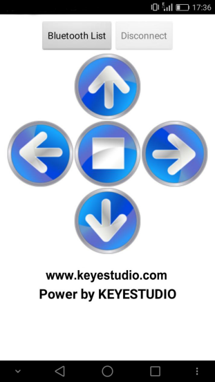
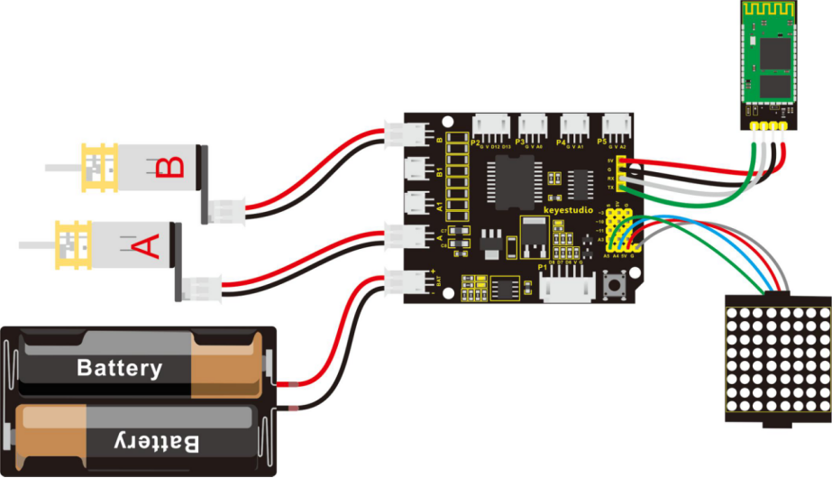
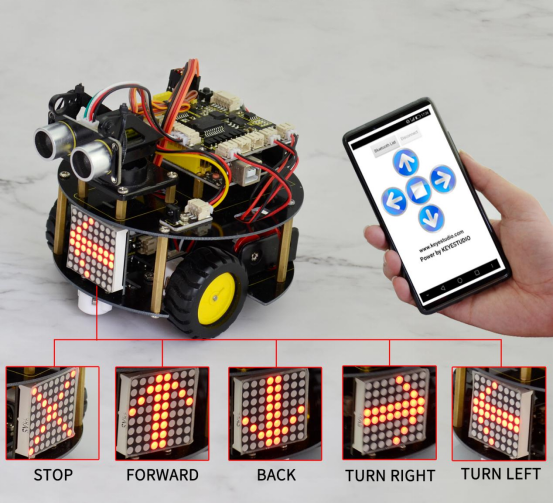

### Project 13 Bluetooth Controlled Turtle Robot

**1.Overview**

In the previous section, you have learned the principles of Bluetooth and how to use Bluetooth to control a small light. Okay, based on that, could we use Bluetooth to send a command to control the robot run?

Absolutely yeah. In the previous section, we can use a mobile APP to send a character. Use a Bluetooth module to receive the Bluetooth signal from the mobile phone, and feed it back to the main control board. Then main control board will analyze and judge the collected signals. If correct, it will control the robot run.

Here we don't need a Bluetooth serial assistant as mentioned above. Just use an Android APP developed by our keyestudio team to control the robot.

**Please download the app here**.


The interface of this APP is very simple, as shown below.



Connected the Bluetooth, let’s make use of a little program that can read the serial data, to check what character the five buttons send. Then apply them to the example code for Bluetooth robot in the following projects.

**2.Test Code 16**

```c
char val; // define the variable val

void setup()
{
	Serial.begin(9600);// set the baud rate as 9600, the same as software setting. When connecting the particular device like Bluetooth, it should be consistent with the baud rate of other devices.  
}

void loop()
{
    val=Serial.read();//read the data received from serial port, and assign it to val
    Serial.println(val);// print val data
    delay(300);//delay 0.3S
}
```

Through the above program, we can get that five buttons are Upward (“U”), Downward (“D”), Left (“L”), Right (“R”), and Stop (“S”). The principle is very simple.

When Bluetooth module receives these characters sent by the mobile phone, and then it will send them to ARDUINO. ARDUINO will control the rotation direction of motor according to the preset value in the code.

When receive the information "U", smart robot will move forward. When receive "D", it goes backward. If receive "L", turn left. If receive "R", turn right. The smart car will stop when receive the "S".

**3.Hookup Guide**

**Note:** Bluetooth module is directly plugged into the shield.



**4.Test Code 17**

**Pay special attention:** should first upload the code successfully, then connect the Bluetooth module. Otherwise, fail to upload the code.

```c
#include <Wire.h>
#include "Adafruit_LEDBackpack.h"
#include "Adafruit_GFX.h"
Adafruit_LEDBackpack matrix = Adafruit_LEDBackpack();

#define INT_A 2    //define the left motor control pin as D2
#define INT_B 4    // define the right motor control pin as D4
#define left_A 9     // define the left motor speed pin as D9
#define right_B 5    // define the right motor speed pin as D5

void setup() 
{
  Serial.begin(9600);     // set the baud rate of monitor to 9600
  delay(100);     //delay 100ms
  pinMode(INT_A,OUTPUT);    // set the motor control pin as OUTPUT
  pinMode(INT_B,OUTPUT);
  pinMode(left_A,OUTPUT);
  pinMode(right_B,OUTPUT);
  
  // DOT matrix
  matrix.begin(0x70);  // pass in the address
  chushi();       // initial matrix image
}

void loop() 
{
  int val;    //define the variable, used to receive the data from Bluetooth
  if(Serial.available())     // if receive the data 
  {
    val = Serial.read();       // assign the data read to val
  }
  switch(val)    // perform the corresponding function for data received
  {
    case 'U':  front(),qian();  break;   //if val equals U，then perform the front function（front()）and image function（qian()），break statement means that exist the current function if receive other data
    case 'D':  back(),hou();   break;    //backward
    case 'L':  left(),zuo();   break;    // turn left
    case 'R':  right(),you();  break;    // turn right 
    case 'S':  Stop(),ting();   break;   // stop
    default :Serial.print("error");  
  }

}

// go front
void front()
{
  digitalWrite(INT_A,LOW);    // control the left motor rotate forward
  digitalWrite(INT_B,LOW);   // control the right motor rotate forward
  analogWrite(left_A,200);   // set the two motors’ speed（PWM=200)
  analogWrite(right_B,200); 
}
// backward
void back()  
{
  digitalWrite(INT_A,HIGH);   // control the left motor rotate backward 
  digitalWrite(INT_B,HIGH);    // control the right motor rotate backward 
  analogWrite(left_A,200);   
  analogWrite(right_B,200);
}
// turn left 
void left()
{
  digitalWrite(INT_A,HIGH);    // control the left motor rotate backward
  digitalWrite(INT_B,LOW);    // control the right motor rotate forward
  analogWrite(left_A,100);    // two motors’ speed（PWM为100）
  analogWrite(right_B,100);
}
// turn right 
void right()
{
  digitalWrite(INT_A,LOW);     // control the left motor rotate forward  
  digitalWrite(INT_B,HIGH);     // control the right motor rotate backward 
  analogWrite(left_A,100);
  analogWrite(right_B,100);
}
// stop
void Stop()
{
  digitalWrite(INT_A,LOW);  
  digitalWrite(INT_B,LOW);
  analogWrite(left_A,0);    //both PWM are 0
  analogWrite(right_B,0);
}

/////////////////////dot matrix/////////////////////////
// front image
void qian()
{
    matrix.displaybuffer[3] = B11111111;
    matrix.displaybuffer[4] = B11111111;
    matrix.displaybuffer[2] = B00000001;
    matrix.displaybuffer[1] = B00000010;
    matrix.displaybuffer[0] = B00000100;
    matrix.displaybuffer[5] = B00000001;
    matrix.displaybuffer[6] = B00000010;
    matrix.displaybuffer[7] = B00000100;
    matrix.writeDisplay();
}
// backward image 
void hou()
{
    matrix.displaybuffer[3] = B11111111;
    matrix.displaybuffer[4] = B11111111;
    matrix.displaybuffer[2] = B00100000;
    matrix.displaybuffer[1] = B00010000;
    matrix.displaybuffer[0] = B00001000;
    matrix.displaybuffer[5] = B00100000;
    matrix.displaybuffer[6] = B00010000;
    matrix.displaybuffer[7] = B00001000;
    matrix.writeDisplay();
}
// turn right image
void you()
{
    for(int i=0;i<8;i++)
    {
      matrix.displaybuffer[i] = B00001100;
    }
    matrix.displaybuffer[6] = B00011110;
    matrix.displaybuffer[5] = B00101101;
    matrix.displaybuffer[4] = B11001100;
    matrix.writeDisplay();
}
// turn left image 
void zuo()
{
    for(int i=0;i<8;i++)
    {
      matrix.displaybuffer[i] = B00001100;
    }
    matrix.displaybuffer[1] = B00011110;
    matrix.displaybuffer[2] = B00101101;
    matrix.displaybuffer[3] = B11001100;
    matrix.writeDisplay();
}
// stop image
void ting()
{
    matrix.displaybuffer[0] = B11000000;
    matrix.displaybuffer[1] = B00100001;
    matrix.displaybuffer[2] = B00010010;
    matrix.displaybuffer[3] = B00001100;
    matrix.displaybuffer[4] = B00001100;
    matrix.displaybuffer[5] = B00010010;
    matrix.displaybuffer[6] = B00100001;
    matrix.displaybuffer[7] = B11000000;
    matrix.writeDisplay();
}
// initial image
void chushi()
{
    matrix.displaybuffer[0] = B00000011;
    matrix.displaybuffer[1] = B10000000;
    matrix.displaybuffer[2] = B00010011;
    matrix.displaybuffer[3] = B00100000;
    matrix.displaybuffer[4] = B00100000;
    matrix.displaybuffer[5] = B00010011;
    matrix.displaybuffer[6] = B10000000;
    matrix.displaybuffer[7] = B00000011;
    matrix.writeDisplay();
}
```

**5.Example Result**

Done uploading the above code to control board, turn on the POWER button on the shield, then open APP, connect to Bluetooth, you should see the LED on the Bluetooth module is normally on.

Press down any buttons on APP, you can control the smart robot to run freely, showing the state image on the dot matrix display.



