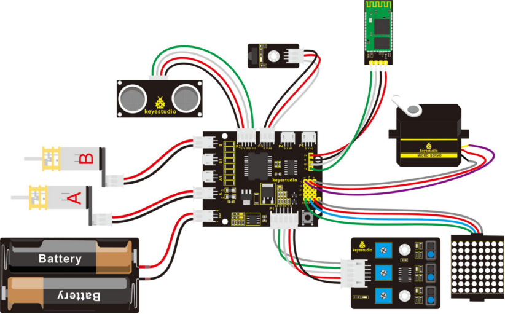
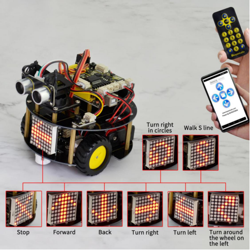

### Project 14 4 in 1 Complete Robot

**1.Overview**

In the above projects, we have introduced four functions for the turtle robot, that is, line following, avoiding obstacles, IR control and Bluetooth remote control.

Now, let’s combine those functions together to make a complete robot. You can use the IR module to switch the functions.

**2.Function switching methods**

Powered on and aligned with the IR receiver, press the number 1 on the IR remote control, the turtle robot will enter the line tracking function. Then press the key OK, it will exist the tracking function.

- If press the number 2, enter the obstacle avoidance function, and press OK to end that function.
- If press the number 3, enter the S line forward, and press OK to end the function.
- If press the number 4, the robot will turn around the wheel on the left, and press OK to end the function.
- If press the number 5, the robot will turn a circle to the left, and press OK to end the function.
- If press the number 6, the robot will turn a circle to the right, and press OK to end the function.

When exist the function modes, be able to control the car through infrared control or Phone-Bluetooth control.

**3.Hookup Guide**



**4.Test Code 18**

```c
// dot matrix
#include <Wire.h>   // add IIC file
#include "Adafruit_LEDBackpack.h" 
#include "Adafruit_GFX.h"
Adafruit_LEDBackpack matrix = Adafruit_LEDBackpack();   // build an object to control the dot matrix

// IR receiver
#include <IRremote.h>    // add the IR receiver libraries
int RECV_PIN = A0;        // define the IR receiver pin as A0
IRrecv irrecv(RECV_PIN);
decode_results results;
// decoding of IR remote control
const long IR_front = 0x00FF629D;
const long IR_back = 0x00FFA857;
const long IR_left = 0x00FF22DD;
const long IR_right = 0x00FFC23D;
const long IR_stop = 0x00FF02FD;
const long IR_1 = 0x00FF6897;
const long IR_2 = 0x00FF9867;
const long IR_3 = 0x00FFB04F;
const long IR_4 = 0x00FF30CF;
const long IR_5 = 0x00FF18E7;
const long IR_6 = 0x00FF7A85;
const long IR_7 = 0x00FF10EF;
const long IR_8 = 0x00FF38C7;
const long IR_9 = 0x00FF5AA5;
const long IR_0 = 0x00FF52AD;

// line following 
const int S1 = 8;  // the S1 tracking sensor control pin to D8
const int S2 = 7;  // the S2 tracking sensor control pin to D7
const int S3 = 6;  // the S3 tracking sensor control pin to D6
int s1,s2,s3;   // define 3 variables，separately used to receive the digital value read by 3 tracking sensors（0 or 1）

// avoiding obstacles
const int servopin=3;// define the digital 3 to connect to servo signal line
//int myangle;// define the angle
//int pulsewidth;// define the pulsewidth 
#include <SR04.h>    // add the ultrasonic libraries 
#define TRIG_PIN 12   // define the pin ting of ultrasonic as D12
#define ECHO_PIN 13   //  define the pin echo of ultrasonic as D13
SR04 sr04 = SR04(ECHO_PIN,TRIG_PIN);    // build an object to control the ultrasonic
long a,a1,a2;      // used to receive the distance measured by ultrasonic
// end the obstacle avoidance

// control two motors 
#define INT_A 2    // control the left motor direction pin as D2
#define INT_B 4    // control the right motor direction pin as D4
#define left_A 9    // control the left motor speed pin as D9
#define right_B 5   //control the right motor direction pin as D5 


long val;       // define a variable to receive the signal from IR transmitter
int i=0;

void setup() 
{ 
  Serial.begin(9600);           // set the baud rate of serial monitor to 9600
  irrecv.enableIRIn();            // Start the receiver
  delay(100);           // delay 100ms
  pinMode(INT_A,OUTPUT);           // set the motor control pin as OUTPUT
  pinMode(INT_B,OUTPUT);
  pinMode(left_A,OUTPUT);
  pinMode(right_B,OUTPUT);

  // DOT matrix
  matrix.begin(0x70);  // pass in the address
  chushi();         // initial matrix display 

  pinMode(servopin,OUTPUT);// set the servo pin as OUTPUT 
   // make the ultrasonic turn front 
  for(int i=0;i<=100;i++) // give enough time to servo to rotate to specific angle
  {
      digitalWrite(servopin,HIGH);// set the servo pin to HIGH 
      delayMicroseconds(1200);// delay the microseconds of pulsewidth 
      digitalWrite(servopin,LOW);// set the servo pin to LOW 
      delayMicroseconds(18800);// delay the microseconds of pulsewidth
  }
}

void loop() 
{
  i=1;
  Bluetooth();     // Bluetooth control
  if(irrecv.decode(&results))   // if receive the infrared signal 
  {
    val = results.value;      // assign the result to val
    Serial.println(val,HEX);    // print out the hexadecimal val value on the monitor
    
    irrecv.resume();    // Receive the next value
 }
 switch(val)   // perform the corresponding function for the data received
    {
      case  IR_front:  front(),qian();  break;   // go front and display the front image //if val equals to IR_front（IR_front=0x00FF629D)，perform front() and qian() these two subfunctions，break statement is used to exist the current function
      case  IR_back:  back(),hou();    break;    // backward and show the back image
      case  IR_left:  left(),zuo();    break;    // turn left and show the left image
      case  IR_right:  right(),you();   break;   // turn right and show the right image
      case  IR_stop:  Stop(),ting();   break;    // stop and show the stop image
      case  IR_1:  xunji(),val=0;   break;       // enter the tracking function（ press stop to end the function）
      case  IR_2:  bizhang(),val=0;   break;     // enter the obstacle avoiding function（ press stop to end the function）
      case  IR_3:  left_l(),ZZ();  break;        // turn around the wheel on the left 
      case  IR_4:  right_run(),YX();   break;    // turn around to the right 
      case  IR_5:  front_s();  break;        // go front in S line and display S image 
      case  IR_6:  left_run(),ZX();   break;    //  turn around to the left
      default : printf("error");  
    }

}

// go front
void front()
{
    digitalWrite(INT_A,LOW);    // control the left motor turn forward 
    digitalWrite(INT_B,LOW);   // control the right motor turn forward 
    analogWrite(left_A,200);   // set the two motors’ speed （PWM=200)
    analogWrite(right_B,200);
}
// go backward
void back()  
{
  digitalWrite(INT_A,HIGH);   //  control the left motor turn backward 
  digitalWrite(INT_B,HIGH);    // control the right motor turn backward  
  analogWrite(left_A,200);   // set the two motors’ speed（PWM=200)
  analogWrite(right_B,200);
}
// turn left
void left()
{
  digitalWrite(INT_A,HIGH);    // control the left motor turn backward 
  digitalWrite(INT_B,LOW);    // control the right motor turn forward  
  analogWrite(left_A,150);    //  set the two motors’ speed（PWM为150）
  analogWrite(right_B,150);
}
//turn right 
void right()
{
  digitalWrite(INT_A,LOW);     //  control the left motor turn forward
  digitalWrite(INT_B,HIGH);     //  control the right motor turn backward
  analogWrite(left_A,150);    //  set the two motors’ speed（PWM为150）
  analogWrite(right_B,150);
}
// stop
void Stop()
{
  digitalWrite(INT_A,LOW);  
  digitalWrite(INT_B,LOW);
  analogWrite(left_A,0);    // both PWM are 0
  analogWrite(right_B,0);
}
// turn around the wheel on the left 
void left_l()
{
    digitalWrite(INT_A,HIGH);   // control the left motor turn backward 
    digitalWrite(INT_B,LOW);   // control the right motor turn forward 
    analogWrite(left_A,0);     //left PWM=0，means that the left wheel stops 
    analogWrite(right_B,255);    //right PWM=255，right wheel goes forward 
}
// turn around to the right
void right_run()
{
    digitalWrite(INT_A,LOW);    //control the left motor turn forward 
    digitalWrite(INT_B,LOW);   //  control the right motor turn forward 
    analogWrite(left_A,255);   // left motor PWM=255
    analogWrite(right_B,100);   // right motor PWM=100 
}
// turn around to the left
void left_run()
{
    digitalWrite(INT_A,LOW);    // control the left motor turn forward
    digitalWrite(INT_B,LOW);   // control the right motor turn forward 
    analogWrite(left_A,200);   // left motor PWM=100
    analogWrite(right_B,100);   // right motor PWM=200 （turn a circle to the left）
}

// go front in S line
void front_s()
{
    S();
  while(i>0)
  {
    digitalWrite(INT_A,LOW);   // control the left motor turn forward 
    digitalWrite(INT_B,LOW);   // control the right motor turn forward
    analogWrite(left_A,50);   // left motor PWM=100
    analogWrite(right_B,255);  // right motor PWM=255  （ walk in curved line to the left）
    delay(300);      //delay 1 second
    analogWrite(left_A,255);   //left motor PWM=255   
    analogWrite(right_B,50);  //right motor PWM=100  （ walk in curved line to the right ）
    delay(300);      //delay 1S
    if(irrecv.decode(&results))   // if receive the infrared signal 
    {
      irrecv.resume();    // Receive the next value
      val=results.value;    // assign the received data to val
      if(val==IR_stop)   // if receive the stop command 
      {
        Stop();       // stop 
        break;        // end the current function 
      }
    }
  }
}
////////////////////////matrix display image////////////////////////////
// front image 
void qian()
{
    matrix.displaybuffer[3] = B11111111;     
    matrix.displaybuffer[4] = B11111111;
    matrix.displaybuffer[2] = B00000001;
    matrix.displaybuffer[1] = B00000010;
    matrix.displaybuffer[0] = B00000100;
    matrix.displaybuffer[5] = B00000001;
    matrix.displaybuffer[6] = B00000010;
    matrix.displaybuffer[7] = B00000100;
    matrix.writeDisplay();
}
// back image 
void hou()
{
    matrix.displaybuffer[3] = B11111111;
    matrix.displaybuffer[4] = B11111111;
    matrix.displaybuffer[2] = B00100000;
    matrix.displaybuffer[1] = B00010000;
    matrix.displaybuffer[0] = B00001000;
    matrix.displaybuffer[5] = B00100000;
    matrix.displaybuffer[6] = B00010000;
    matrix.displaybuffer[7] = B00001000;
    matrix.writeDisplay();
}
//right image 
void you()
{
    for(int i=0;i<8;i++)
    {
      matrix.displaybuffer[i] = B00001100;
    }
    matrix.displaybuffer[6] = B00011110;
    matrix.displaybuffer[5] = B00101101;
    matrix.displaybuffer[4] = B11001100;
    matrix.writeDisplay();
}
// left image 
void zuo()
{
    for(int i=0;i<8;i++)
    {
      matrix.displaybuffer[i] = B00001100;
    }
    matrix.displaybuffer[1] = B00011110;
    matrix.displaybuffer[2] = B00101101;
    matrix.displaybuffer[3] = B11001100;
    matrix.writeDisplay();
}
// stop image 
void ting()
{
    matrix.displaybuffer[0] = B11000000;
    matrix.displaybuffer[1] = B00100001;
    matrix.displaybuffer[2] = B00010010;
    matrix.displaybuffer[3] = B00001100;
    matrix.displaybuffer[4] = B00001100;
    matrix.displaybuffer[5] = B00010010;
    matrix.displaybuffer[6] = B00100001;
    matrix.displaybuffer[7] = B11000000;
    matrix.writeDisplay();
}
// initial display 
void chushi()
{
   for(int i=0;i<8;i++)
   {
    matrix.displaybuffer[i] = B10101010;
    matrix.writeDisplay();
    delay(100);
   }
}

//turn around the wheel on the left 
void ZZ()
{
    matrix.displaybuffer[0] = B00000000;
    matrix.displaybuffer[1] = B10000011;
    matrix.displaybuffer[2] = B11000001;
    matrix.displaybuffer[3] = B10100010;
    matrix.displaybuffer[4] = B00010100;
    matrix.displaybuffer[5] = B00001000;
    matrix.displaybuffer[6] = B00000000;
    matrix.displaybuffer[7] = B00000000;
    matrix.writeDisplay();
}
//turn around to the left 
void ZX()
{
    matrix.displaybuffer[0] = B00000000;
    matrix.displaybuffer[1] = B00011100;
    matrix.displaybuffer[2] = B00100010;
    matrix.displaybuffer[3] = B01000001;
    matrix.displaybuffer[4] = B00000001;
    matrix.displaybuffer[5] = B00111001;
    matrix.displaybuffer[6] = B00110010;
    matrix.displaybuffer[7] = B00101100;
    matrix.writeDisplay();
}
//turn around to the right 
void YX()
{
    matrix.displaybuffer[0] = B00001100;
    matrix.displaybuffer[1] = B00110010;
    matrix.displaybuffer[2] = B00111001;
    matrix.displaybuffer[3] = B00000001;
    matrix.displaybuffer[4] = B00000001;
    matrix.displaybuffer[5] = B00100010;
    matrix.displaybuffer[6] = B00011100;
    matrix.displaybuffer[7] = B00000000;
    matrix.writeDisplay();
}
//S line 
void S()
{
    matrix.displaybuffer[0] = B00000000;
    matrix.displaybuffer[1] = B00000000;
    matrix.displaybuffer[2] = B00110001;
    matrix.displaybuffer[3] = B11001000;
    matrix.displaybuffer[4] = B11000100;
    matrix.displaybuffer[5] = B00100011;
    matrix.displaybuffer[6] = B00000000;
    matrix.displaybuffer[7] = B00000000;
    matrix.writeDisplay();
}

//*******************************line tracking*******************************//
void xunji()
{
  while(val)
  {
    s1 = digitalRead(S1); // assign the digital value read from S1，S2,S3 pin to s1,s2,s3
    s2 = digitalRead(S2);
    s3 = digitalRead(S3);
    if(s2==1)  // if s2 pin detects a black line
    {
      if(s3==1 && s1==0)  // if s3 detects a black line，s1 not detect
      {
        left();     // turn left
      }
      else if(s3==0 && s1==1)  // if s3 not detect, but s1 detects
      {
        right();   // turn right
      }
      else      // or else 
      {
        front();   // go front
      }
    }

    else  //s2 not detect a black line 
    {
      if(s3==1&&s1==0)  // if s3 detects a black line 
      {
        left();     // turn left
      }
      else if(s3==0&&s1==1)  //s1 detects a black line 
      {
        right();    // turn right
      }
      else  // none detects a black line
      {
        Stop();      // stop
      }
    }
    if(irrecv.decode(&results))   // if receive the infrared signal
    {
      irrecv.resume();    // Receive the next value
      val=results.value;    // assign the received data to val
      if(val==IR_stop)   // if receive the stop command
      {
        Stop();       //stop
        break;        // exist the current function 
      }
    }
  }
}
//************************* end tracking********************************//

//******************************* avoiding obstacles *****************************//
void bizhang()
{
  while(val)
  {
     a=sr04.Distance();    // assign the front distance measured by ultrasonic to a
     Serial.print(a);     // print out the value a on the serial monitor
     Serial.println("cm");   // print out cm and line wrap
     delay(100);    //delay 
     if(a<15)    // if a is less than 15cm, yes to perform the program in the brace below
     {
      Stop();    // stop
      delay(100);   //delay 100ms
      //servopulse(servopin,160);// call the pulse function to make the ultrasonic turn right in 90 degrees
      // make the ultrasonic turn left in 90 degrees 
      for(int i=0;i<=100;i++) // give servo enough time to rotate to the specific angle
      {
          digitalWrite(servopin,HIGH);// set the servo pin to HIGH 
          delayMicroseconds(600);// the microseconds to delay plusewidth
          digitalWrite(servopin,LOW);// set the servo pin to LOW
          delayMicroseconds(19400);// the microseconds to delay plusewidth
      }
      
      a1=sr04.Distance();  // assign the left obstacle distance measured by ultrasonic to a1
      Serial.print("a1 = ");  // on the serial monitor print out a1 = 
      Serial.print(a1);      // print out the value of a1
      Serial.println("cm");   // print out cm and line wrap
      delay(100);    // delay 100ms
      //servopulse(servopin,20);//call the pulse function to make the ultrasonic turn left in 90 degrees
      //make the ultrasonic turn right in 90 degrees 
      for(int i=0;i<=300;i++) // give servo enough time to rotate to the specific angle 
      {
          digitalWrite(servopin,HIGH);// set the servo pin to HIGH 
          delayMicroseconds(1800);//the microseconds to delay pulsewidth
          digitalWrite(servopin,LOW);// set the servo pin to LOW
          delayMicroseconds(18200);// the microseconds to delay pulsewidth
      }
      
      a2=sr04.Distance();      // assign the right obstacle distance measured by ultrasonic to a2
      Serial.print("a2 = ");
      Serial.print(a2);
      Serial.println("cm");
      delay(100);
      if(a1<a2)     //if a1 is greater than a2（whether left distance is greater than  right one）
      {
       // servopulse(servopin,90);// call the pulse function to make the ultrasonic turn front
      //  make the ultrasonic turn front
      for(int i=0;i<=200;i++) // give servo enough time to rotate to the specific angle 
      {
          digitalWrite(servopin,HIGH);// set the servo pin to HIGH  
          delayMicroseconds(1200);// the microseconds to delay pulsewidth 
          digitalWrite(servopin,LOW);//  set the servo pin to LOW
          delayMicroseconds(18800);// the microseconds to delay pulsewidth 
      }
        left();    // TURN LEFT
        delay(370);   // delay 370ms,the time for car to turn left in 90 degrees as much as possible 
        front();  // go front
      }
      else     // if a1<a2
      {
        //servopulse(servopin,90);// call the pulse function to make the ultrasonic turn front
        // make the ultrasonic turn front 
        for(int i=0;i<=100;i++) // give servo enough time to rotate to the specific angle 
        {
        digitalWrite(servopin,HIGH);// set the servo pin to HIGH  
        delayMicroseconds(1200);// the microseconds to delay pulsewidth
        digitalWrite(servopin,LOW);// set the servo pin to LOW
        delayMicroseconds(18800);// the microseconds to delay pulsewidth 
        }
        right();  // TURN RIGHT 
        delay(370);  // delay 370ms，the time for car to turn right in 90 degrees as much as possible
        front();   // go front
      }
     }
     else   // if a>15cm
     {
      front();   // continue to go forward
     }
     if(irrecv.decode(&results))   // if receive the infrared signal
    {
      irrecv.resume();    // Receive the next value
      val=results.value;    // assign the infrared data received to val
      if(val==IR_stop)   // if it is stop key
      {
        Stop();    // stop
        break;     // exist the current function
      }
    }
  }
   
}

/*// servo
void servopulse(int servopin,int myangle)// define a pulse function
{
  for(int i=0;i<50;i++)
  {
    pulsewidth=(myangle*11)+500;// convert the angle into pulsewidth of 500-2480 
    digitalWrite(servopin,HIGH);// set the servo pin to HIGH 
    delayMicroseconds(pulsewidth);// the microseconds to delay pulsewidth 
    digitalWrite(servopin,LOW);// set the servo pin to LOW
    delay(20-pulsewidth/1000);
  }

}*/
//*******************************end the obstacle avoiding function*********************************//

//*******************************Bluetooth*************************************//
void Bluetooth()
{
  int temp;    // define the variable, used to receive the data read by Bluetooth
  if(Serial.available())     // if receive the data 
  {
    temp = Serial.read();       // assign the data received to temp
  }
  switch(temp)    // perform the corresponding function for the data received
  {
    case 'U':  front(),qian();  break;   // if val equals to U，perform front() and qian() subfunction，break statement means that exist the current function if receive other data.
    case 'D':  back(),hou();   break;
    case 'L':  left(),zuo();   break;
    case 'R':  right(),you();  break;
    case 'S':  Stop(),ting();   break;
    default : printf("error");  
  }

}
```

**5.Example Result**

Done uploading the above code to control board, turn on the POWER button on the shield, then open APP, connect to Bluetooth, you should see the LED on the Bluetooth module is normally on.

Then use an IR remote control to select the function modes to make the robot run freely, showing the state image on the dot matrix display.

