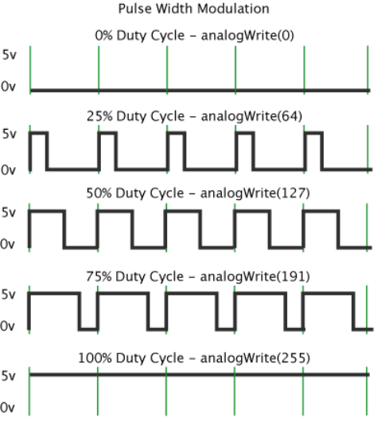
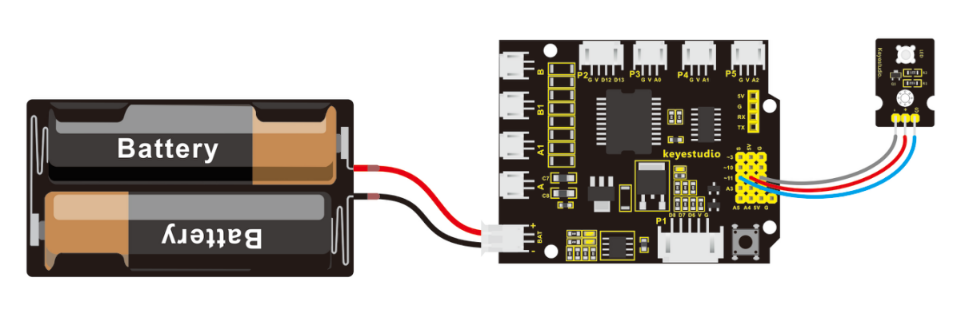

### Project 2 PWM Controlled Brightness

**1.Overview**

In the previous project, you have learned how to turn on or off an LED. So you may be interested in changing the brightness of an LED light, just making it like the bedside lamp in your bedroom.

It is indeed important for you to master the knowledge of PWM. Right, PWM is short for Pulse Width Modulation. How can it be understood in a simple way? We all know that the voltage output of Arduino Digital port only has two states, LOW and HIGH, corresponding to the voltage output of 0V and 5V.

If merely make use of LOW and HIGH state, it cannot control the brightness of an LED light. However, if convert the voltage output of 0 Volts and 5 Volts into the value within 0-255, this way you can change the value within 0-255 to control the brightness of light. It is much more feasible, isn’t it ?

Pulse Width Modulation, or PWM, is a technique for getting analog results with digital means. Digital control is used to create a square wave of different duty cycle, a signal switched between on and off. This on-off pattern can simulate voltages in between full on (5 Volts) and off (0 Volts) by changing the portion of the time the signal spends on versus the time that the signal spends off. 

The Arduino controller has totally 6 PWM outputs, which are Digital 3, 5, 6, 9, 10 and 11. Shown as follows.


These pins can be used as Digital output or Analog output. If used as Analog output, it needs to call the **analogWrite()** function of ARDUINO, and this analogWrite() function can be controlled in the range of 0-255.

In the graphic below, the green lines represent a regular time period. This duration or period is the inverse of the PWM frequency. In other words, with Arduino's PWM frequency at about 500Hz, the green lines would measure 2 milliseconds each. A call to analogWrite() is on a scale of 0-255, such that analogWrite(255) requests a 100% duty cycle (always on), and analogWrite(127) is a 50% duty cycle (on half the time) for example.



In fact, PWM can be applied to dimming lamps, motor speed, sound production, etc.

In the following, we are going to control the brightness of the LED.

**2.Hookup Guide**

On the aspect of hardware, we still utilize the LED connected to D11 mentioned above. You can refer to the wiring diagram as follows:



**3.Sample Code 2**

```c
int LED= 11;//define the LED pin 
int i = 0;//define a variable i，

void setup()
{
	pinMode(LED,OUTPUT); //set LED pin as OUTPUT
}

void loop()
{
    for(i = 0;i < 255;i++)
    { 
    	//variable is changed from 0 to 254（fade in）
    	analogWrite(LED, i);//set LED brightness
    	delay(10);//delay 10ms, analogWrite function will be finished in a short time. 
    	//speed is too fast to observe                             
    }
    for(i =255;i > 0; i--)
    { 
        //variable is changed from 255 to 1（fade out）
        analogWrite(LED, i);//set LED brightness
        delay(10); //delay 10ms
    }
}
```

**4.Code Explanation** 

- **analogWrite(LED, i); ** Writes an analog value (PWM wave) to a pin. Can be used to light a LED at varying brightnesses or drive a motor at various speeds. After a call to analogWrite(), the pin will generate a steady square wave of the specified duty cycle until the next call to analogWrite() (or a call to digitalRead() or digitalWrite()) on the same pin. The frequency of the PWM signal on most pins is approximately 490 Hz.

- **Syntax: analogWrite（pin,value）**

It has two parameters:

1. **pin:** the pin to write to. Allowed data types: int.

2. **value:** the duty cycle: between 0 (always off) and 255 (always on). Allowed data types: int

**5.Example Result**

Upload the above code to the board, you could change the LED brightness in the code.


Furthermore, in the motor driving project below, it also involves the concept PWM.