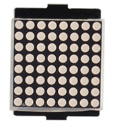
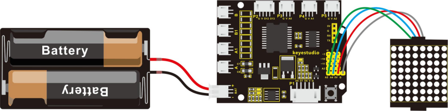
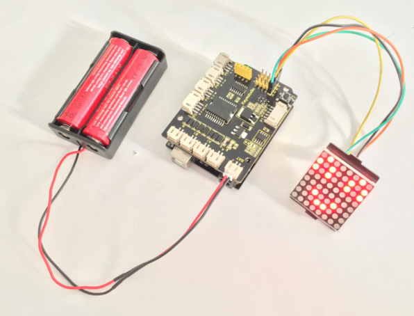

### Project 3 Light up LED Matrix

**1.Overview**



In the previous project, we have simply tested the LED. Now we have added a new 8*8 Dot Matrix module to the turtle to show the robot states. Amazing display!

Do you know how is the cool advertising display made? It is exactly composed of these small LED matrix. If you want to make a similar display, this keyestudio 8 * 8 Dot Matrix module will meet you need.

This tiny display has 64 LEDs packed into a 8*8 dot matrix. It integrated HT16K33as driver chip, so with this LED matrix module, you can control it through connecting the I2C communication interfaces ( A4-SDA ; A5-SCL).

It is great for displaying image/text or creating bizarre patterns, and is highly portable and convenient to use. Of course you can program it via IDE or via Mixly block. With just a few steps, you are ready to impress others!

**2.Hookup Guide**

Connect the LED matrix module to the pin header on the motor drive shield. Connect the SCL pin to pin A5, SDA pin to pin A4; Connect VCC pin to 5V, GND to ground.



**3.Sample Code 3**

```c
#include <Wire.h>
#include "Adafruit_LEDBackpack.h"
#include "Adafruit_GFX.h"
Adafruit_LEDBackpack matrix = Adafruit_LEDBackpack();

void setup() 
{
  Serial.begin(9600);
  Serial.println("HT16K33 test");
  
  matrix.begin(0x70);  // pass in the address
}

void loop() 
{
  /////////smile face///////////////
    matrix.displaybuffer[0] = B00000011;
    matrix.displaybuffer[1] = B10000000;
    matrix.displaybuffer[2] = B00010011;
    matrix.displaybuffer[3] = B00100000;
    matrix.displaybuffer[4] = B00100000;
    matrix.displaybuffer[5] = B00010011;
    matrix.displaybuffer[6] = B10000000;
    matrix.displaybuffer[7] = B00000011;
    matrix.writeDisplay();
}
```

**4.Result**

Place the LED matrix as the right picture shown.

In the experiment, you can control the LED dot matrix display through the code **matrix.displaybuffer[0] = B00000011**.

**Note:** the number **0** in the **matrix.displaybuffer[0]** represents the columns of LED. The number 0 is the first column, and the number 1 represents the second column. The rest can be done in the same manner.
**B00000011** represents the on and off state of 8 LEDs in the cols. The number 0 represents off, while the number 1 represents on.

So **matrix.displaybuffer[0] = B00000011** means that the first column, the LEDs in the row 1, 8, 7, 6, 5, 4 are set to off, the LEDs in the row 3 and 2 are on.

Hookup well and upload the code to the board, you should see the keyestudio 8 * 8 Dot matrix show a smile face.



