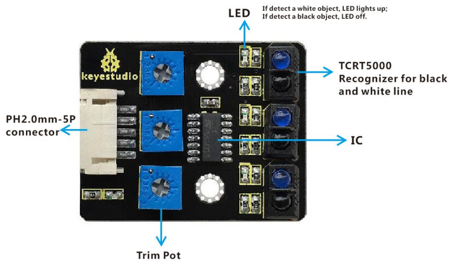
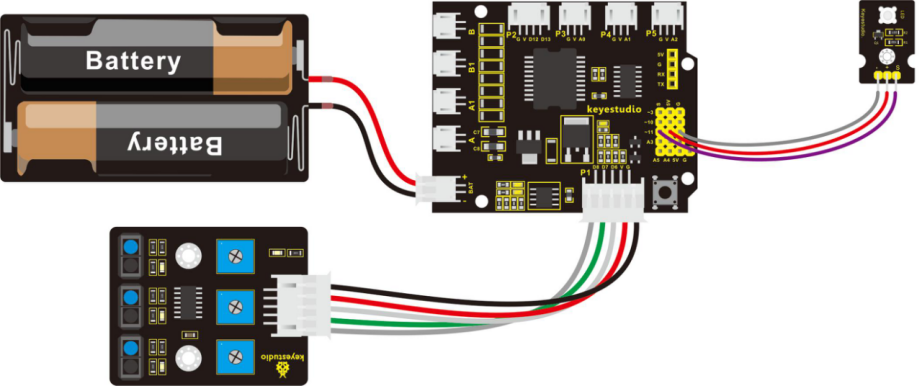
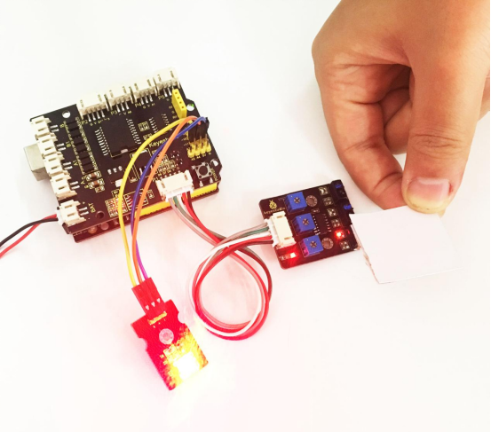

### Project 4 Principle and Application of Line Tracking Sensor

**1.Overview**

The tracking sensor is actually an infrared sensor. The component used here is the TCRT5000 infrared tube.

Its working principle is to use the different reflectivity of infrared light to the color, then convert the strength of the reflected signal into a current signal.

During the process of detection, black is active at HIGH level, but white is active at LOW level. And detection height is 0-3 cm.

The following figure is our keyestudio 3-channel line tracking module. We have integrated 3 sets of TCRT5000 infrared tube on a single board, which is more convenient for wiring and control.

By rotating the adjustable potentiometer on the sensor, it can adjust the detection sensitivity of the sensor.



**2.TECH SPECS**

- Operating Voltage: 3.3-5V (DC)
- Interface: 5PIN
- Output Signal: Digital signal
- Detection Height: 0-3 cm

**3.Wiring Diagram**

Okay, next let’s do a simple test for this tracking module. Connect the line tracking module to the shield using connector wire. Then connect the LED module to the pin11 header on the shield. The connection diagram is shown as below.



Wire it up well as the above diagram, then you can type the following test code.

**4.Test Code 4**

```c
int sensor1 = 6; // define the pin of left sensor as pin D6
int ledPin =11; //define LEDpin as Digital 11

void setup() 
{
    pinMode(sensor1, INPUT); //define the sensor as INPUT
    pinMode(ledPin,OUTPUT); //define LED as OUTPUT
}

void loop() 
{
  if( digitalRead(sensor1)==LOW)  // read the state of sensor, if detect the white paper, it is at LOW level.
  {
     digitalWrite(ledPin, HIGH);  // light an LED
  }
  else // or else
  {
     digitalWrite(ledPin, LOW); // turn off an LED
  }
}
```

So how do you think about that? It is really simple. For another two-channel, you can refer to the above code to finish the testing.

**5.Test Code 5:**

```c
int sensor2 = 7; // define the pin of middle sensor as pin D7
int ledPin =11; // define LEDpin as Digital 11

void setup() 
{
    pinMode(sensor2, INPUT); // define the sensor as INPUT
    pinMode(ledPin,OUTPUT); // define LED as OUTPUT
}
void loop() 
{
   if( digitalRead(sensor2)==LOW)  // read the state of sensor, if detect the white paper, it is at LOW level.
   {
       digitalWrite(ledPin, HIGH);  // light an LED
   }
   else //or else
   {
      digitalWrite(ledPin, LOW); // turn off an LED
  }
}
```

**6.Test Code 6:**

```c
int sensor3 = 8; //  define the pin of right sensor as pin D8
int ledPin =11; // define LEDpin as Digital 11

void setup() 
{
    pinMode(sensor3, INPUT); // define the sensor as INPUT
    pinMode(ledPin,OUTPUT); // define LED as OUTPUT
}

void loop() 
{
   if( digitalRead(sensor3)==LOW)  //read the state of sensor, if detect the white paper, it is at LOW level.
   {
  	  digitalWrite(ledPin, HIGH);  // light an LED
   }
   else // or else
   {
      digitalWrite(ledPin, LOW); // turn off an LED
   }
}
```

Upload well the code to the board, you should see that if the tracking sensor detects a white object, the LED module will light up.



In the section below, we are about to match the digital sensors with other modules to make interactive works.