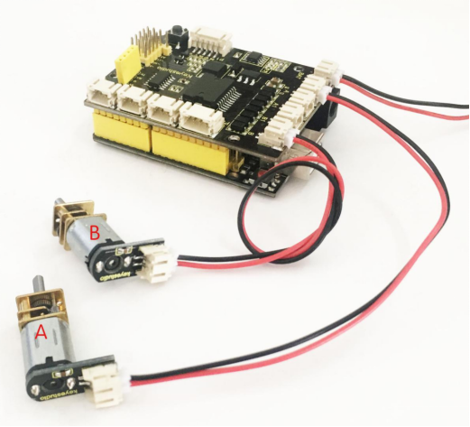
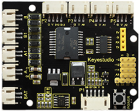
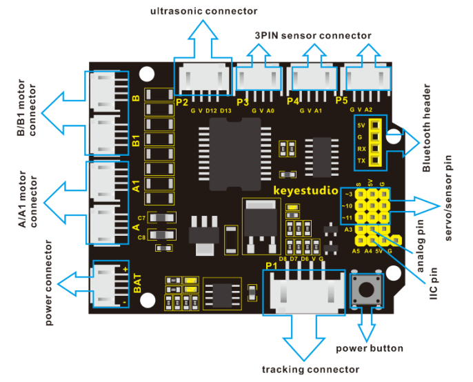
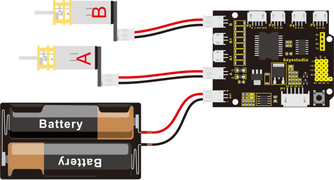
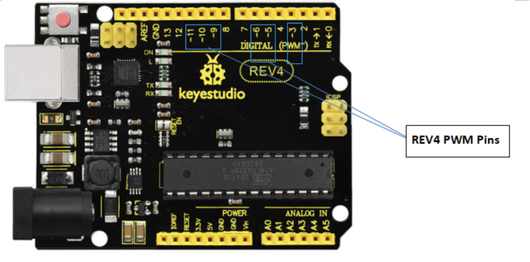
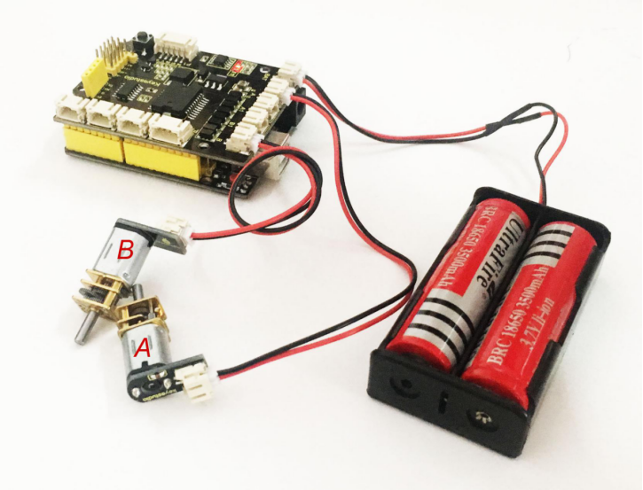

### Project 5 Motor Driving and Speed Control



**1.Overview**

There are many ways to drive the motor. Our robot uses the most commonly used L298P solution. L298P is an excellent high-power motor driver IC produced by STMicroelectronics. It can directly drive DC motors, two-phase and four-phase stepping motors.

The driving current up to 2A, and output terminal of motor adopts eight high-speed Schottky diodes as protection. We have designed the motor driver shield based on the L298P circuit.

The stackable design can make it be plugged directly into the Arduino, reducing the technical difficulty of using and driving the motor.



When stack the driver shield onto UNO R3 board, after the BAT is powered on, press the POWER button lightly. The external power will be supplied to both the driver shield and UNO R3 board at the same time.

In order to facilitate wiring, the driver shield comes with an anti-reverse interface. When connecting the motor, power supply and sensor modules, you just need to plug in correctly.

The Bluetooth interface on the driver shield is fully compatible with keyestudio HC-06 Bluetooth module. When connecting, you just need to plug HC-06 Bluetooth module into the corresponding interface.

At the same time, the drive shield solders 2.54mm pin headers to lead out some unused digital ports and analog ports, so that you can continue to add other sensors for experiments extension.

**2.Specifications**

- Logic part input voltage: 5V

- Driving part input voltage: DC 7-12V
- Logic part working current: <36mA
- Driving part working current: <2A
- Maximum power dissipation: 25W (T=75℃)
- Control signal input level:
  - High level: 2.3V<Vin<5V  
  - Low level: -0.3V<Vin<1.5V
- Working temperature: -25℃～＋130℃

**3.Pinout Instructions**

As the diagram shown below, you can get the detailed information of connectors on the motor drive shield.



**4.Driving DC Motor**

In the previous section, we have shown you the basic principle and parameters of L298P motor drive module. You can get the details of all interfaces on the board. So in the following, we will formally introduce how to drive the motor? First, you should connect well two motors to the shield, i.e. motor A and motor B shown as below.



Well, next let’s create the sketch.

The code logic of the robot is nothing more than 5 kinds of movement modes, namely go forward, go backward, turn left, turn right and stop. So think about it. How could it implement those functions?

Simply, for example, both left and right motor of robot turn forward, so it is able to go forward. If both the left and right motor turn reverse, the robot will go backward. 

Besides, if the left motor turns forward but right motor turns reverse, the robot will turn right. If the right motor turns forward but left motor turns reverse, the robot will turn left.

So how to control the forward and backward of motor? Actually, you can easily achieve that by controlling the microcontroller pin for motor direction to be HIGH or LOW level.

It is much more easier to understand the motor turning, however, it would be a little bit complicated to work out the speed control of motor. As for the speed control of motor, it involves the PWM mode mentioned in the previous section. So what is PWM?

PWM is the short for Pulse Width Modulation. PWM is a technique for getting analog results with digital means. Digital control is used to create a square wave (a signal switched between on and off) to control the analog output. The output voltage of Arduino Digital port only has LOW and HIGH level, corresponding to the output voltage of 0 Volts and 5 Volts.

Like the graphic shown below, the green lines represent a regular time period. This duration or period is the inverse of the PWM frequency. In other words, with Arduino's PWM frequency at about 500Hz, the green lines would measure 2 milliseconds each.

A call to analogWrite() is on a scale of 0-255, such that analogWrite(255) requests a 100% duty cycle (always on), and analogWrite(127) is a 50% duty cycle (on half the time) for example.


For example, we have marked the PWM pins that can be used for analog output on the UNO board.

The PWM pins are D3, D5, D6, D9, D10, and D11.



The function called by the PWM is: **analogWrite(pin, value)**.

Note that the value is between 0 (always off) and 255 (always on). The speed of the motor is controlled actually by this value. The bigger the value is, the faster the speed is. Rather, the smaller the value is, the slower the speed it is until it stops.

In the following figure, look at the language logic for motor states: go forward, backward, turn left, turn right and stop.

**M1** and **M2** represent the motor’s direction control, that is, forward and backward rotation.

**E1** and **E2** represent the speed control, and speed is set to 150.

| E1       | M1   |      | E2                    | M2   |      |                       |
| -------- | ---- | ---- | --------------------- | ---- | ---- | --------------------- |
| Forward  | 150  | HIGH | Motor A goes forward  | 150  | HIGH | Motor B goes forward  |
| Backward | 150  | LOW  | Motor A goes backward | 150  | LOW  | Motor B goes backward |
| Left     | 150  | LOW  | Motor A goes forward  | 150  | HIGH | Motor B goes backward |
| Right    | 150  | HIGH | Motor A goes backward | 150  | LOW  | Motor B goes forward  |
| Stop     | 0    | LOW  | Motor A stops         | 0    | LOW  | Motor B stops         |

**5.Example Code 7**

Okay, next we will start to write the example code. The part of Single line comment (//) is the explanation for the code. Based on that, you can understand it better.

```c
int E1 = 9; //  set the speed pin of motor A as D9
int E2 = 5; //  set the speed pin of motor B as D5
int M1 = 2; // set the direction pin of motor A as D2
int M2 = 4; // set the direction pin of motor B as D4
        
void setup(void)
{
  pinMode(M1,OUTPUT); // set M1 as OUTPUT mode
  pinMode(M2,OUTPUT); // set M2 as OUTPUT mode
  pinMode(E1,OUTPUT); //  set E1 as OUTPUT mode
  pinMode(E2,OUTPUT); //  set E2 as OUTPUT mode
}

void advance(void)        // set the forward motion
{
  digitalWrite(M1,HIGH);  // motor A turns forward, the wheel will go forward.
  digitalWrite(M2,HIGH);  // motor B turns forward, the wheel will go forward. 
  analogWrite(E1,150);    // speed of motor A（can be adjusted according to the actual speed of motor. Turn up the value to accelerate, lower the value to decelerate.) 
  analogWrite(E2,150);    // speed of motor B（can be adjusted according to the actual speed of motor. Turn up the value to accelerate, lower the value to decelerate.) 
} 

void back(void)        // set the backward motion
{
  digitalWrite(M1,LOW);   // motor A turns reverse and the wheel will go backward
  digitalWrite(M2, LOW);   //  motor B turns reverse and the wheel will go backward
  analogWrite(E1,150);     //  speed of motor A
  analogWrite(E2, 150);    //  speed of motor B
}  

void turnL(void)     // set the left turn 
{
   digitalWrite(M1,LOW);    // motor A turns reverse and the wheel will go backward 
   digitalWrite(M2, HIGH);  // motor B turns forward and the wheel goes forward, the smart car will turn left.
   analogWrite(E1,150);  // speed of motor A
   analogWrite(E2, 150);  // speed of motor B
}

void turnR(void)            //  set the right turn 
{
   digitalWrite(M1,HIGH);   // motor A turns forward and the wheel will go forward 
   digitalWrite(M2,LOW);    // motor B turns reverse and the wheel goes backward, the smart car will turn right.
   analogWrite(E1,150);     // speed of motor A
   analogWrite(E2, 150);    // speed of motor B
}

void stopp(void)   // set the STOP
{
   digitalWrite(M1,LOW);  // motor A turns reverse
   digitalWrite(M2, LOW);  //  motor B turns reverse
   analogWrite(E1, 0);      //  speed of motor A, speed as zero, means stop
   analogWrite(E2, 0);      // speed of motor B, speed as zero, means stop
}

void loop() 
{ 
    advance();   // go forward
    delay(1000); // delay1S
    back();      //backward
    delay(1000);// delay1S

    turnL();    //turn left
    delay(1000);//delay1S
    turnR();    //turn right  
    delay(1000); //delay1S
    stopp();   // stop
    delay(1000);// delay1S
}
```

**6.Test Result:**

Stack well the drive shield onto UNO R3 board, and upload the above code to the board, then press down the POWER button, you should see the motor go forward for one second, backward one second, then turn left for one second, turn right for one second and stop one second, alternately repeating.

