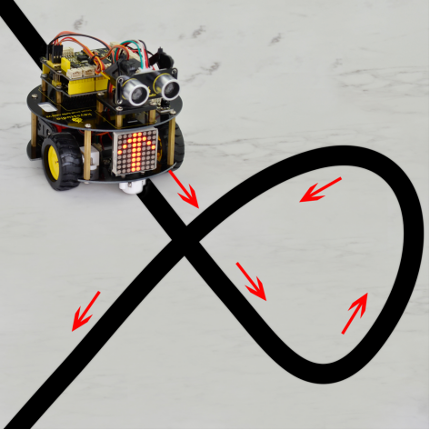
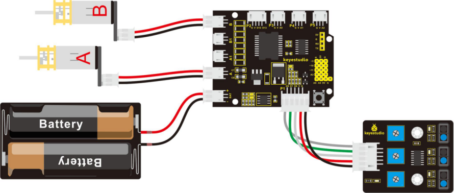
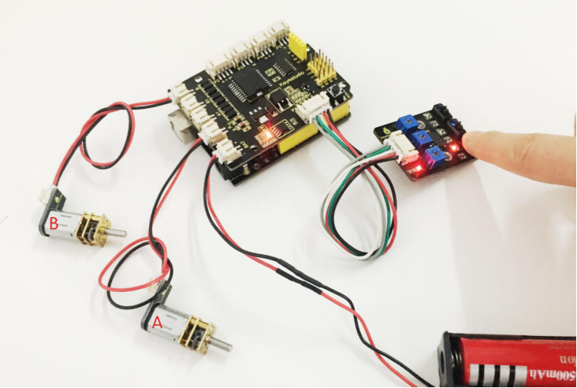
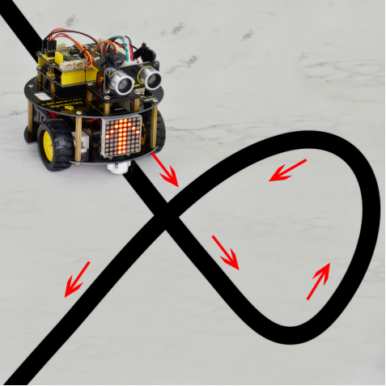

### Project 6 Line Tracking Turtle



**1.Overview**

In the previous sections, you have learned the principles and applications of both tracking module and the motor drive shield. After master that knowledge, let’s combine these two modules to make the turtle with line tracking function.

So first what does line tracking mean? It refers to following the line trajectory. For instance, the smart robot will always follow or track the black line.

The principle is using the tracking sensor to detect the black track on the pavement, and detection signal will feed back to ARDUINO main control board. Then main control board will analyze and judge the collected signals to control and drive the motor in time, thus can adjust the turning direction of turtle robot.

That is why the turtle robot can automatically follow the black track, achieving the automatic line tracking function.

This technology has been applied to many areas such as driverless vehicles, unmanned factories, warehouses, and service robots.

**2.Project Principle**

Using the characteristic that black has low reflectivity to light.

When flat surface is not black, the infrared light transmitted by the sensor will be reflected back mostly, so the sensor outputs low level 0.

When the flat surface has a black line and the sensor is above the black line, the reflected infrared light is very less due to the weak reflectivity of black, so it does not reach the action level and sensor outputs high level 1.

Use the main control board to determine whether the output end of sensor is 0 or 1, finally detect the black line. The main control board will control the turning direction of motor according to the received signal, so finally can control the movement of smart car. This is a simple line tracking robot.

**3.Wiring Diagram**

Connect the tracking sensor, two motors and battery pack to the motor drive shield as follows.



**4.Example Code 8**

Wire it up well as the above diagram. Okay, let’s move on to write the test code. Think about the code logic. There are two kinds of tracking sensor’s states as follows:

1.The middle tracking sensor detects a black line, if the sensor on the left side detects a white line, while the sensor on the right side detects a black line, the smart car will turn right. On the contrary, if the sensor on the right detects a white line, but the left one detects a black line, the smart car will turn left. If both sides detect a white line or a black line, it will go forward.

2.The middle tracking sensor does not detect a black line, if the sensor on the left side detects a white line, while the sensor on the right side detects a black line, the smart car will turn right. On the contrary, if the sensor on the right detects a white line, but the left one detects a black line, the smart car will turn left. If three sensors all detect a white line, it will stop.

Well, figure out the logic, then combine the example code of motor driving mentioned in the above section, you can have a try to write out the logic of line tracking.

```c
#define INT_A 2 // define the left motor direction pin D2
#define INT_B 4 // define the right motor direction pin D4
#define left_A 9 // define the left motor speed（PWM）pin D9
#define right_B 5 // define the right motor speed（PWM）D5

const int S1 = 8;  // S1 right tracking sensor control pin to D8
const int S2 = 7;  // S2 middle tracking sensor control pin to D7
const int S3 = 6;  // S3 left tracking sensor control pin to D6
int s1,s2,s3;   //define three variables, separately receive the digital value read by 3-channel tracking sensor (0 or 1)

void setup() 
{  
  Serial.begin(9600);    //set the monitor baud rate to 9600
  delay(100);       //delay 100ms
  pinMode(INT_A,OUTPUT);      // set the motor control pin as OUTPUT
  pinMode(INT_B,OUTPUT);
  pinMode(left_A,OUTPUT);
  pinMode(right_B,OUTPUT);
}

void loop() 
{
    s1 = digitalRead(S1); //assign the digital value read from pin S1，S2,S3 to s1,s2,s3
    s2 = digitalRead(S2);
    s3 = digitalRead(S3);
    
    if(s2==1)  //if s2 pin detects a black line
    {
      if(s3==1 && s1==0)  //if s3 pin detects a black line but s1 doesn’t 
      {
        left();     // turn left
      }
      else if(s3==0 && s1==1)  //if s3 does not detect a black line, but s1 detects it.
      {
        right();   //turn right 
      }
      else      //other situations
      {
        front();   // go forward
      }
    }
  
    else  //s2 does not detect a black line 
    {
      if(s3==1&&s1==0)  //if s3 detects a black line 
      {
        left();     //turn left
      }
      else if(s3==0&&s1==1)  //s1 detects a black line
      {
        right();    // turn right
      }
      else  // none detect black line
      {
        Stop();      // stop
      }
    }
    
}

// forward
void front()
{
  digitalWrite(INT_A,LOW);    // control the left motor turn forward
  digitalWrite(INT_B,LOW);   // control the right motor turn forward
  analogWrite(left_A,200);   // set the motor speed（PWM=200)
  analogWrite(right_B,200); 
}

//backward
void back()  
{
  digitalWrite(INT_A,HIGH);   // control the left motor turn backward 
  digitalWrite(INT_B,HIGH);    // control the right motor turn backward
  analogWrite(left_A,200);   
  analogWrite(right_B,200);
}

//turn left
void left()
{
  digitalWrite(INT_A,HIGH);    // control the left motor turn backward
  digitalWrite(INT_B,LOW);    // control the right motor turn forward
  analogWrite(left_A,100);    // motors speed（PWM为100）
  analogWrite(right_B,100);
}

// turn right 
void right()
{
  digitalWrite(INT_A,LOW);     // control the left motor turn forward
  digitalWrite(INT_B,HIGH);     // control the right motor turn backward 
  analogWrite(left_A,100);
  analogWrite(right_B,100);
}

// stop
void Stop()
{
  digitalWrite(INT_A,LOW);  
  digitalWrite(INT_B,LOW);
  analogWrite(left_A,0);    // both side PWM is 0
  analogWrite(right_B,0);
}
```

**5.Example Picture**



Upload well the above code to the main board, then press down the POWER button on the motor drive shield. If draw a black line on the ground, you should see that the smart car will track the black line.

