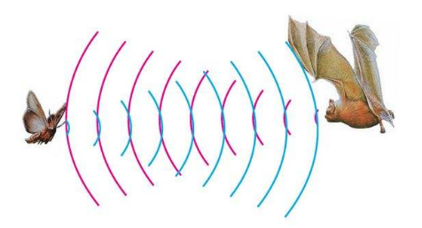
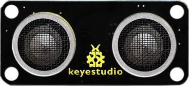
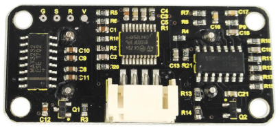
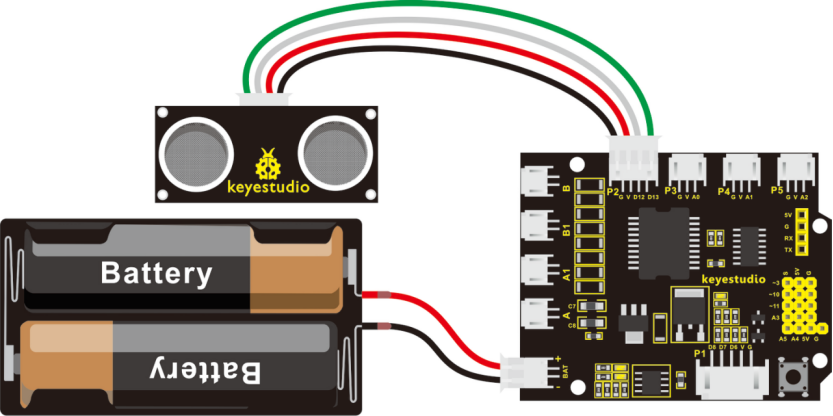
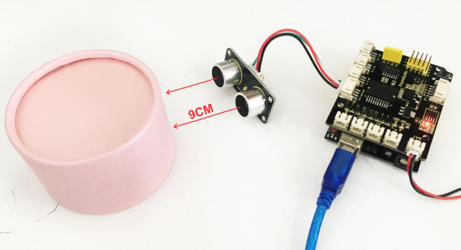
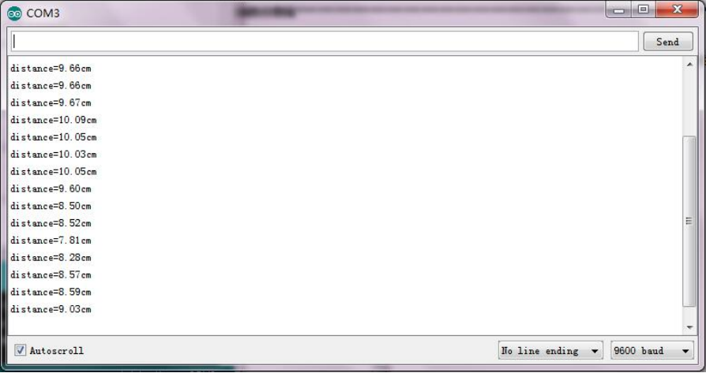

### Project 7 Principle and Application of Ultrasonic Module



**1.Description**

There is an animal called bat in nature. The bats can fly at night, not depend on its eyes, but on its ears and vocal organs. When the bat flies, it will emit a scream, an ultrasonic signal that humans cannot hear because of its high audio frequency. If these ultrasonic signals hit other objects on the flight path, they will be reflected back immediately. After receive the returned information, the bats complete the whole process of listening, seeing, calculating and bypassing obstacles during the flutter.

The principle of the ultrasonic rangefinder module is as the same as the above principle.

The ultrasonic module will emit the ultrasonic waves after trigger signal. When the ultrasonic waves encounter the object and are reflected back, the module outputs an echo signal, so it can determine the distance of object from the time difference between trigger signal and echo signal.

Ultrasonic sensor has a wide range of sensitivity, no blind area, and no interference with obstacles.

As the following picture shown, it is our keyestudio ultrasonic module. You can see it has two somethings like eyes. One is transmitting end, the other is receiving end.





**2.TECH SPECS**

- Operating Voltage: 5V（DC）
- Operating Current: 15mA
- Operating Frequency: 40khz
- Maximum Detection Distance: 3-5m
- Minimum Detection Distance: 3-4cm
- Sensing Angle: less than 15 degrees

**3.Hookup Guide**

Connect the ultrasonic module to the shield. Shown as below.



**Notice:**

1.Must first connect the ultrasonic module and then power up. Or connect the ground first.

2.Measurement period is better at more than 60ms. To prevent the impact of the transmitted signal to the echo signal.

**When using it:**
(1) Use IO trigger ranging, at least 10us HIGH level signal; that is, first pull the Trip Low, then give a HIGH level signal of 10us.
(2) The module automatically sends eight square waves of 40khz to automatically detect whether there is a signal return back;
(3) There is a signal return, through the IO output a High level, and the duration period of High level is the time of Ultrasonic wave from emission to return.

**Test distance = (High level time \* speed of sound (340M/S))/2**

Then you can get the formula: **detection distance = (High level time/58)(cm)**

**4.Example Code 9**

```c
int pinTrip=12;// connect the SR04 Trip , give more than 10us High level
int pinEcho=13;// connect the Echo pin , the time to receive the High level
float distance=0;// save the distance

void setup() 
{
    // put your setup code here, to run once:
    pinMode(pinTrip,OUTPUT);
    pinMode(pinEcho,INPUT);
    Serial.begin(9600);
}

void loop() 
{
    // put your main code here, to run repeatedly:
    digitalWrite(pinTrip,LOW);
    delayMicroseconds(2); // pull down Level
    digitalWrite(pinTrip,HIGH);
    delayMicroseconds(12);// give 12us High level
    digitalWrite(pinTrip,LOW);// pull down Level
    distance=pulseIn(pinEcho,HIGH);// check the High level time
    delay(10);
    distance=distance/58; // get the distance
    Serial.print("distance=");
    Serial.print(distance);
    Serial.println("cm");
    delay(500);
}
```

**5.Test Result**

Stack well the shield on UNO R3 board, and upload well the above code, then open the serial monitor of Arduino IDE, set the baud rate to 9600. 

When ultrasonic sensor detects an obstacle ahead, on the monitor you should see the distance measured between obstacle and sensor. Shown below.



