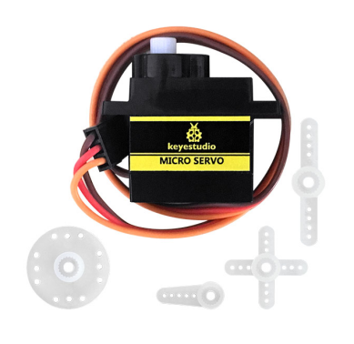
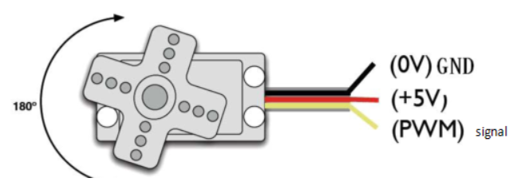
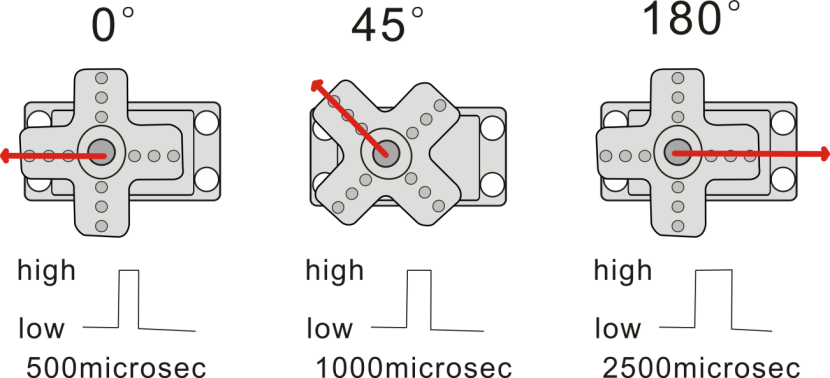
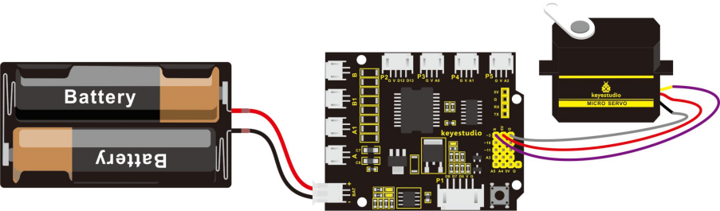
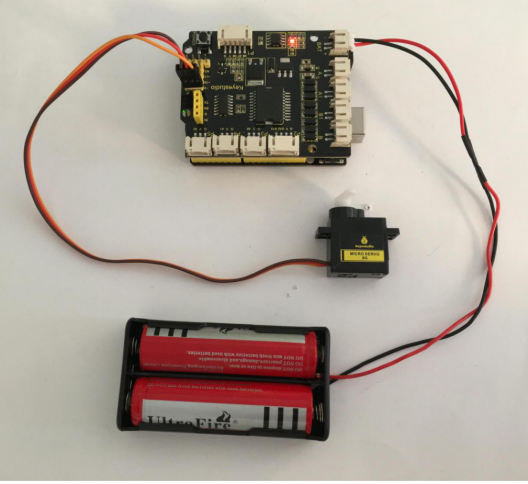

### Project 8 Micro Servo Control



**1.Description**

Servo motor is a position control rotary actuator. It mainly consists of housing, circuit board, core-less motor, gear and position sensor.

Included with your servo motor you will find a variety of white motor mounts that connect to the shaft of your servo. You may choose to attach any mount you wish for the circuit. It will serve as a visual aid, making it easier to see the servo spin.

**2.Working principle**

The receiver or MCU outputs a signal to the servo motor. The motor has a built-in reference circuit that gives out reference signal, cycle of 20ms and width of 1.5ms. The motor compares the acquired DC bias voltage to the voltage of potentiometer and outputs a voltage difference.

Servo motors come with many specifications. But all of them have three connection wires, distinguished by brown, red, orange color (different brand may have different color). Brown one is for GND, red one for power positive, orange one for signal.



When you send the right signal through the signal wire, the servo will move to a specific angle and stay there. Common servos rotate over a range of about 0° to 180°. The signal that is sent is a PWM signal.



The rotation angle of servo motor is controlled by regulating the duty cycle of PWM(Pulse-Width Modulation) signal. The standard cycle of the PWM signal is 20ms (50Hz). Theoretically, the width is distributed between 1ms-2ms, but in fact, it's between 0.5ms-2.5ms. The width corresponds the rotation angle from 0° to 180°.

**3.Parameters**

- Operating voltage: DC 4.8V〜6V
- Angle range: about 180°(in 500→2500μsec)
- Pulse width range: 500→2500μsec
- No-load speed: 0.12±0.01 sec/60（DC 4.8V）; 0.1±0.01 sec/60（DC 6V）
- No-load current: 200±20mA（DC 4.8V）; 220±20mA（DC 6V）
- Stop torque: 1.3±0.01kg/cm（DC 4.8V）; 1.5±0.1kg/cm（DC 6V）
- Stop current: ≦850mA（DC 4.8V）; ≦1000mA（DC 6V）
- Standby current: 3±1mA（DC 4.8V）; 4±1mA（DC 6V）
- Operation temperature: -10℃〜50℃
- Save temperature: -20℃〜60℃
- Motor wire length: 250 ± 5 mm
- Dimensions: 22.9mm * 12.2mm * 30mm
- Weight: 9± 1 g (without servo mounts)

**4.Hookup Guide**

Ready to start hooking everything up? Check out the connection diagram below. Connect the black servo to the shield. Brown wire is for GND, red one for 5V pin, orange one for signal pin.



You can check out the test code for the servo below.

**5.Code 10**

```c
int servopin=3;// define the digital 9 is connected to servo signal line 
int myangle;// define the angle variable
int pulsewidth;// define the pulsewidth variable
int val;

void setup()
{
    pinMode(servopin,OUTPUT);// set the servo interface as OUTPUT
    Serial.begin(9600);// connect to serial port, baud rate to 9600
    Serial.println("servo=o_seral_simple ready" );
    servopulse(servopin,90);// call the pulse function, make the servo rotate to 90degree
} 

void loop()
{
   servopulse(servopin,90);// call the pulse function, make the servo rotate to 90degree
}

void servopulse(int servopin,int myangle)// define a pulse function 
{
    pulsewidth=(myangle*11)+500;// convert the angle into pulse width of 500-2480 
    digitalWrite(servopin,HIGH);// set the servo pin to HIGH 
    delayMicroseconds(pulsewidth);// delay the microseconds of pulsewidth
    digitalWrite(servopin,LOW);// set the servo pin to LOW
    delay(20-pulsewidth/1000);
}
```

**6.Test Result**

Wire it up and upload well the code, press down the reset button on the shield, micro servo will rotate to the angle of 90 degrees.

