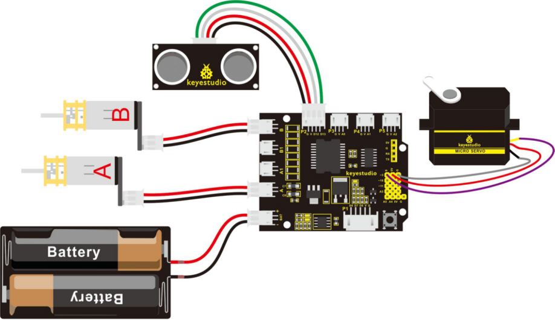
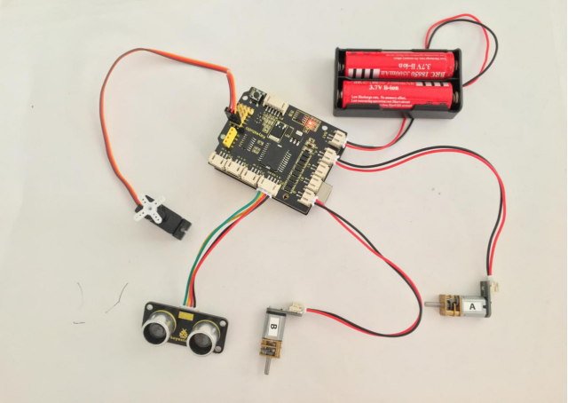
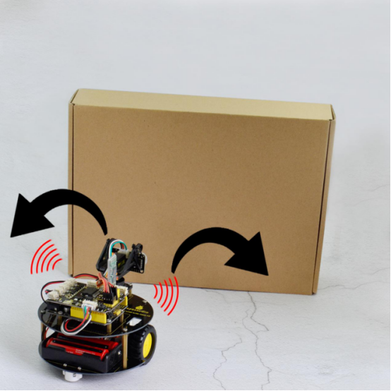

### Project 9 Turtle Robot Avoiding Obstacles

**1.Description**

It is rather not suitable for human to work in some relatively harsh environments. At this moment, if we have a robot that can shuttle freely in such environments, then how good should it be!

Based on this original intention, our team develop the robot that be able to automatically avoid an obstacle when running on complicated terrain.

This project is a simple and automatic obstacle avoidance system based on Arduino control board. The smart robot with UNO R3 as the controlling core, makes use of ultrasonic module and micro servo of 180 degrees to detect the obstacles, and the detection signal will feed back to the control board.

Arduino main board will then analyze and judge the collected signals to control the motor driving in time. Finally control the smart car automatically avoid an obstacle ahead to run forward smoothly.

**2.Project Principle**

- Use the ultrasonic module to detect the distance between the robot and obstacle ahead.
- When the measured distance between ultrasonic sensor and obstacle ahead is less than 15cm, smart robot will stop for 100ms. The ultrasonic will make use of servo to turn left in 90 degrees, and stop for 100ms to detect the obstacle distance on the left. Then use the servo to turn right in 180 degrees, stop to detect the obstacle distance on the right.
- If the distance measured at the left side is greater than that of the right side, ultrasonic sensor will first turn to the front, turtle robot turns left in 90 degrees and then goes forward.
- Otherwise, turtle robot will turn right in 90 degrees and then go forward.
- Arduino control board will control the motor’s rotating direction and servo angle according to the distance value measured by ultrasonic sensor between robot and obstacle.

**3.Wiring Diagram**

Firstly you can follow the connection diagram below. Connect the ultrasonic module, micro servo and two motors to the drive shield.



**4.Code 11**

Let’s move on to an example code for the obstacle avoidance robot. You can see the code reference below:

```c
#define INT_A 2    // control the left motor direction pin to D2
#define INT_B 4    // control the right motor direction pin to D4
#define left_A 9    // define the left motor speed as pin D9
#define right_B 5   // define the right motor speed as pin D5
// Ultrasonic 
int servopin=3;// digital 3 is connected to servo signal pin
int myangle;// define the angle
int pulsewidth;// define the pulsewidth 
#include <SR04.h>    // add the ultrasonic libraries 
#define TRIG_PIN 12   // define the pin ting of ultrasonic as D12
#define ECHO_PIN 13   //define the pin echo of ultrasonic as D13
SR04 sr04 = SR04(ECHO_PIN,TRIG_PIN);    // build the ultrasonic object to control the ultrasonic 
long a,a1,a2;      // used to receive the distance measured by ultrasonic 
void setup() 
{
  Serial.begin(9600);  // set the monitor baud rate to 9600
  delay(100);     // delay 100ms
  pinMode(INT_A,OUTPUT);     // set the motor control pin as OUTPUT 
  pinMode(INT_B,OUTPUT);
  pinMode(left_A,OUTPUT);
  pinMode(right_B,OUTPUT); 
  pinMode(servopin,OUTPUT);// set the servo pin as OUTPUT 
  servopulse(servopin,90);  // call the pulse function, make the ultrasonic keep front.
}

void loop() 
{
   a=sr04.Distance();    // assign the front distance measured by ultrasonic to a
   Serial.print(a);     // print a value on the monitor 
   Serial.println("cm");   // print cm and line wrap 
   delay(100);    // delay
   if(a<15)    // whether the distance a is less than 15cm, if yes, then perform the program in the brace.
   {
    Stop();    // car stops
    delay(100);   // delay 100ms
    servopulse(servopin,160);// call the pulse function to make ultrasonic sensor turn left in 90 degrees
    a1=sr04.Distance();  // assign the left obstacle distance measured by ultrasonic to a1
    Serial.print("a1 = ");  // print out the a1 = on the serial monitor
    Serial.print(a1);      //print a1 value 
    Serial.println("cm");   // print cm and line wrap
    delay(100);    // delay 100ms
    servopulse(servopin,20);// call the pulse function to make ultrasonic sensor turn right in 90 degrees
    a2=sr04.Distance();      // assign the right obstacle distance measured by ultrasonic to a2
    Serial.print("a2 = ");
    Serial.print(a2);
    Serial.println("cm");
    delay(100);
    if(a1>a2)     // whether a1 is greater than a2（whether left distance is greater than that measured on the right side.）
    {
      servopulse(servopin,90);// call the pulse function, make the ultrasonic keep front.
      left();    //turn left
      delay(370);   // delay370ms，the time for car to turn left in 90 degrees as much as possible.
      front();  // go front
    }
    else     // if a1<a2
    {
      servopulse(servopin,90);  // call the pulse function, make the ultrasonic keep front.
      right();  // turn right 
      delay(370);  // delay 370ms，the time for car to turn right in 90 degrees as much as possible. 
      front();   // the car goes forward 
    }
   }
   else   // if a>15cm
   {
    front();   //the car goes forward
   }

}

// forward
void front()
{
  digitalWrite(INT_A,LOW);    // control the left motor turn forward
  digitalWrite(INT_B,LOW);   // control the right motor turn forward
  analogWrite(left_A,200);   // set the motor speed（PWM=200)
  analogWrite(right_B,200); 
}
// backward
void back()  
{
  digitalWrite(INT_A,HIGH);   // control the left motor turn backward 
  digitalWrite(INT_B,HIGH);    //control the right motor turn backward 
  analogWrite(left_A,200);   
  analogWrite(right_B,200);
}
// turn left
void left()
{
  digitalWrite(INT_A,HIGH);    //control the left motor turn backward 
  digitalWrite(INT_B,LOW);    // control the right motor turn forward
  analogWrite(left_A,150);    // two motors’ speed（PWM为150）
  analogWrite(right_B,150);
}
// turn right 
void right()
{
  digitalWrite(INT_A,LOW);     // control the left motor turn forward
  digitalWrite(INT_B,HIGH);     // control the right motor turn backward 
  analogWrite(left_A,150);
  analogWrite(right_B,150);
}
// stop
void Stop()
{
  digitalWrite(INT_A,LOW);   
  digitalWrite(INT_B,LOW);   
  analogWrite(left_A,0);     // PWM of both left and right is 0
  analogWrite(right_B,0);
}
// servo
void servopulse(int servopin,int myangle)// define a pulse function
{
  for(int i=0;i<50;i++)
  {
    pulsewidth=(myangle*11)+500;// convert the angle into the pulsewidth of 500-2480 
    digitalWrite(servopin,HIGH);// servo pin to HIGH 
    delayMicroseconds(pulsewidth);// delay the microseconds of pulsewidth 
    digitalWrite(servopin,LOW);// servo pin to LOW
    delay(20-pulsewidth/1000); // delay the rest circle time to LOW level（20ms circle ）
  }
}
```

**5.Test Result**

Upload the above code to the control board, and stack well the drive shield onto control board, then press lightly down the POWER button on the drive shield.

When detects an obstacle ahead, our smart robot is able to automatically avoid it to run forward freely. You can try it out and see whether it works in that way.



